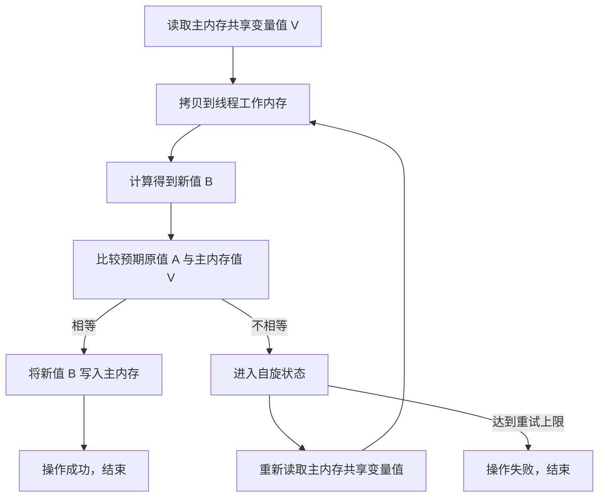

CAS（Compare And Swap）是一种无锁并发编程的核心机制，用于实现原子操作。它通过硬件指令（如 CPU 的 `cmpxchg` 指令）确保操作的原子性，避免线程阻塞。

## 原理

CAS 的原理涉及三个操作数：内存位置（V）、预期原值（A）和新值（B）。操作过程如下：

1. **读取并计算**：线程从主内存中读取共享变量的当前值（V），拷贝到线程工作内存中，进行计算操作得到新值（B）。
2. **比较并交换**：线程将预期原值（A）与新值（B）一起提交到主内存。
   - 如果主内存中的共享变量值等于预期原值（A），说明在此期间无其他线程修改该变量，操作安全，将新值（B）写入主内存。
   - 如果主内存中的共享变量值不等于预期原值（A），说明在此期间其他线程已修改该变量，操作不安全，线程不执行写入，而是进入自旋状态。
3. **自旋重试**：线程重新读取主内存中的共享变量值，重复上述计算和比较过程，直至成功更新或达到重试上限。

## 应用场景

CAS 广泛应用于 Java 并发框架中，典型场景包括：

- **AQS（AbstractQueuedSynchronizer）**：在 `java.util.concurrent.locks` 包中，AQS 使用 CAS 管理同步状态（如 `state` 变量），实现锁的获取和释放。例如，`ReentrantLock` 通过 CAS 确保线程安全地修改锁状态。
- **JUC（Java Util Concurrent）原子类**：如 `AtomicInteger`、`AtomicReference` 等，这些类结合 CAS 和 `volatile` 关键字（保证可见性）实现线程安全。例如，`AtomicInteger.incrementAndGet()` 方法通过 CAS 自旋更新值，避免 `synchronized` 锁的开销。

## 优缺点

- **优点**：
	1. **无锁并发**：通过自旋而非阻塞实现线程安全，减少上下文切换和锁竞争，提升高并发场景下的性能。
	2. **简单高效**：适用于轻量级操作（如计数器更新），代码实现简洁，且硬件支持确保原子性。

- **缺点**：
	1. **自旋消耗 CPU**：在竞争激烈时，线程可能频繁自旋重试，导致 CPU 资源浪费，影响整体系统吞吐量。
	2. **ABA 问题**：如果共享变量值被其他线程修改为 B 后又改回 A，CAS 可能误判为未修改，导致数据不一致。解决方案包括使用版本号（如 `AtomicStampedReference`）。
	3. **适用场景有限**：仅适合简单操作（如单变量更新），复杂操作需结合其他机制（如锁或 `synchronized`）。