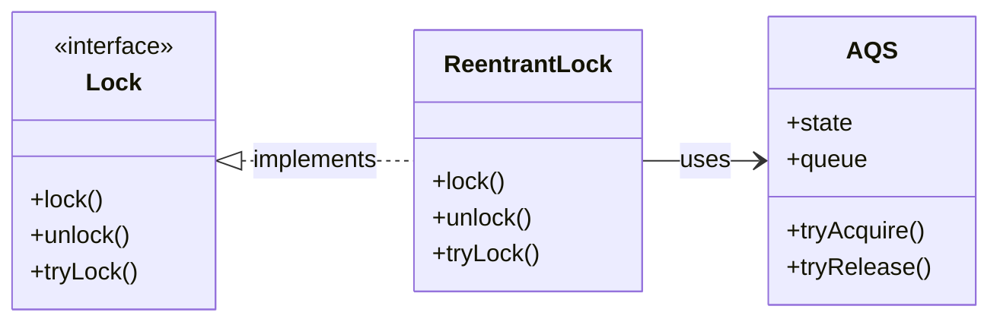

ReentrantLock 是 Java 并发包 (`java.util.concurrent.locks`) 中 `Lock` 接口的核心实现类，提供了比 `synchronized` 关键字更灵活的锁机制。其底层基于 AQS (`AbstractQueuedSynchronizer`) 框架实现，支持可重入性、公平锁、非公平锁等高级特性。

## AQS (AbstractQueuedSynchronizer)

AQS 是一个用于构建阻塞锁和同步器的框架，主要由两部分组成：

1. **state 属性**：一个 `volatile` 修饰的整型变量，用于表示共享资源的状态。
	- 支持**独占模式**（单线程访问）和**共享模式**（多线程并发访问）。
	- 使用 CAS (Compare and Swap) 机制更新 `state`，确保线程安全。
2. **FIFO 等待队列**：一个双向链表实现的队列，用于存储未竞争到锁的线程。
	- 竞争失败的线程会被打包为 `Node` 节点，按顺序加入队列尾部。
	- 释放锁时，队列头部节点被唤醒以重新竞争资源。

两种共工作模式的特点如下：

| 模式       | 特点             | 典型实现类            |
| -------- | -------------- | ---------------- |
| **独占模式** | 同一时刻仅一个线程可访问资源 | `ReentrantLock`  |
| **共享模式** | 允许多个线程同时访问资源   | `CountDownLatch` |

#### state 属性在不同实现中的含义

| 实现类            | state 值的含义                                                                      |
| -------------- | ------------------------------------------------------------------------------- |
| ReentrantLock  | - `state = 0`：资源未被加锁。 - `state = 1`：资源已被加锁。 - `state > 1`：可重入锁（当前线程多次加锁）。 |
| CountDownLatch | `state` 表示剩余计数（倒计时值）。                                                           |

## ReentrantLock 和 Synchronized 的比较

| 特性        | ReentrantLock                | Synchronized        |
| --------- | ---------------------------- | ------------------- |
| **实现层面**  | JDK 代码层面实现（基于 AQS）。          | JVM 层面实现（依赖操作系统指令）。 |
| **用法**    | 需显式调用 `lock()` 和 `unlock()`。 | 修饰方法或代码块（隐式加解锁）。    |
| **公平锁支持** | 支持公平锁和非公平锁。                  | 仅支持非公平锁。            |
| **可重入性**  | 支持。                          | 支持。                 |
| **使用场景**  | 复杂场景（如需要超时、中断或条件变量）。         | 简单场景（代码简单、无高级需求）。   |

## ReentrantLock 如何实现公平锁和非公平锁

公平与非公平是指：

- **公平锁**：线程严格按请求顺序分配锁（FIFO 队列中的等待线程优先）。
- **非公平锁**：允许线程插队尝试抢占锁（新线程可直接竞争，无需入队）。

**ReentrantLock 实现机制**：
- **公平锁**：线程竞争锁时，先检查 FIFO 队列是否有等待线程。若有，则新线程加入队列尾部等待；否则尝试获取锁。
- **非公平锁**：线程竞争锁时，直接尝试 CAS 抢占 `state`。若失败，再打包为 `Node` 加入队列尾部等待。
- **默认行为**：ReentrantLock 默认非公平锁（提升吞吐量），但公平性相对队列中的等待线程而言。队列中的线程始终按顺序唤醒。