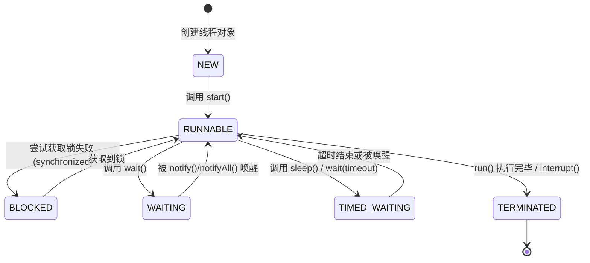

## 线程状态及流转

在 Java 中，线程的状态由 `java.lang.Thread.State` 枚举类定义，共包含六种状态。这些状态描述了线程生命周期的不同阶段及其流转关系。

### Java 线程状态定义

1. **`NEW`（新建状态）**：线程对象通过 `new Thread()` 创建后即处于此状态。此时线程尚未启动，尚未分配系统资源。
2. **`RUNNABLE`（就绪状态/可运行状态）**：调用 `start()` 方法后，线程进入此状态。它表示线程已准备好运行，可能正在等待 CPU 调度或正在执行。在 Java 状态模型中，运行中的线程也归属于 RUNNABLE 状态（无单独的 " 运行 " 状态）。
3. **`BLOCKED`（阻塞状态）**：当线程尝试获取一个对象锁（如 `synchronized` 代码块或方法）而锁被其他线程持有时，线程进入此状态，等待锁释放。
4. **`WAITING`（等待状态）**：当线程调用 `Object.wait()` 方法时进入此状态，表示无限期等待其他线程的通知（如 `notify()` 或 `notifyAll()`）。
5. **`TIMED_WAITING`（计时等待状态）**：当线程调用 `Thread.sleep(long millis)` 或带超时的 `Object.wait(long timeout)` 方法时进入此状态，表示在指定时间内等待。
6. **`TERMINATED`（结束状态）**：线程的 `run()` 方法执行完毕后进入此状态，表示线程生命周期结束，无法再次启动。

### 状态流转过程

- **初始流转**：线程对象创建（`NEW`） → 调用 `start()` 方法 → 进入 RUNNABLE 状态（此时线程可运行，但需等待 CPU 调度）。
- **`RUNNABLE` 到其他状态**：
	- `BLOCKED`：当线程尝试获取锁但锁不可用（例如，在 `synchronized` 块中竞争失败）。
	- `WAITING`：当调用 `wait()` 方法（需在持有锁的上下文中调用）。
	- `TIMED_WAITING`：当调用 `sleep()` 或带超时的 `wait()` 方法。
- **其他状态回转到 `RUNNABLE`**：
	- `BLOCKED` → `RUNNABLE`：当锁被释放且线程成功获取锁。
	- `WAITING` → `RUNNABLE`：当其他线程调用 `notify()` 或 `notifyAll()` 唤醒该线程。
	- `TIMED_WAITING` → `RUNNABLE`：当计时结束或线程被唤醒。
- **终止流转**：`RUNNABLE` → `TERMINATED`：当 `run()` 方法正常结束或线程被中断（如调用 `interrupt()`）。线程一旦进入 TERMINATED 状态，便无法恢复。

状态流转图可简化为：



## 线程创建

### 创建线程的方式

Java 提供了多种创建线程的机制，每种方式适用于不同场景。以下是四种标准方法：

1. **继承 `Thread` 类**
	- 定义一个新类继承 `java.lang.Thread`。
	- 重写 `run()` 方法，实现线程任务逻辑。
	- 通过 `new MyThread().start()` 启动线程。
	- **优点**：简单易用；**缺点**：Java 不支持多重继承，限制了扩展性。
	- **示例**：
		```java
		class MyThread extends Thread {
		  @Override
		  public void run() {
			  // 线程逻辑
		  }
		}
		new MyThread().start();
		```

2. **实现 `Runnable` 接口**
	- 实现 `java.lang.Runnable` 接口，定义 `run()` 方法。
	- 将 Runnable 对象传递给 `Thread` 构造函数。
	- 调用 `Thread.start()` 启动线程。
	- **优点**：避免继承限制，更灵活，支持资源共享；**缺点**：无返回值。
	- **示例**：
		```java
		class MyRunnable implements Runnable {
		  @Override
		  public void run() {
			  // 线程逻辑
		  }
		}
		new Thread(new MyRunnable()).start();
		```

3. **实现 `Callable` 接口结合 `FutureTask`**
	- 实现 `java.util.concurrent.Callable<V>` 接口，重写 `call()` 方法（可返回结果或抛出异常）。
	- 将 `Callable` 对象包装在 `FutureTask` 中（`FutureTask` 实现了 `Runnable` 接口）。
	- 通过 `Thread` 或线程池执行 FutureTask。
	- **优点**：支持返回值（通过 `FutureTask.get()` 获取结果）和异常处理；**缺点**：代码稍复杂。
	- **示例**：
		```java
		class MyCallable implements Callable<String> {
		  @Override
		  public String call() throws Exception {
			  // 线程逻辑，返回结果 
			  return "result";
		  }
		}
		FutureTask<String> task = new FutureTask<>(new MyCallable());
		new Thread(task).start();
		String result = task.get(); // 获取返回值
		```

4. **通过线程池创建线程**
	- 使用 `java.util.concurrent.ExecutorService` 框架（如 `Executors` 工厂类）。
	- 创建线程池（如 `Executors.newFixedThreadPool(int nThreads)`），提交任务（实现 Runnable 或 Callable）。
	- **优点**：高效管理线程生命周期，避免频繁创建/销毁线程的开销，支持任务队列和返回值；**缺点**：需注意线程池配置以避免资源耗尽。
	- **示例**：
		```java
		ExecutorService executor = Executors.newFixedThreadPool(4);
		executor.submit(() -> {
		  // Runnable 或 Callable 任务逻辑
		});
		executor.shutdown(); // 关闭线程池
		```

## 多线程

### 多线程的应用

多线程技术广泛应用于提升程序性能和响应性，尤其在处理耗时或并发任务时。关键应用场景包括：

1. **耗时操作的处理**
	- **文件操作**：通过子线程处理大文件拷贝或迁移，避免主线程阻塞（例如，使用后台线程执行文件 I/O，确保 UI 响应流畅）。
	- **资源加载**：在启动时加载大量资源文件（如图片、配置文件），通过多线程并行加载，加速初始化过程。

2. **网络与并发服务**
	- **聊天软件**：每个客户端连接由一个独立线程处理，支持实时消息接收和发送；线程池管理并发连接，提升吞吐量。
	- **后台服务器**：Web 服务器（如 Tomcat）或微服务框架使用线程池处理 HTTP 请求，实现高并发；数据库连接池也依赖多线程优化查询执行。
