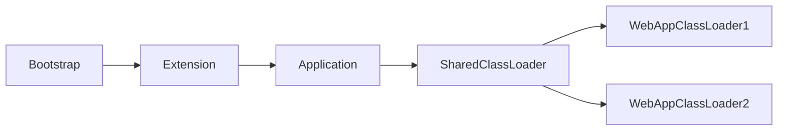

## 类加载器

类加载器（ClassLoader）是 Java 虚拟机（JVM）的重要组成部分，其主要职责是将字节码文件（`.class` 文件）加载到 JVM 内存中，并生成对应的 `Class` 对象。

Java 中的类加载器主要分为以下四类：

1. **Bootstrap ClassLoader（启动类加载器）**
	- 加载 `JAVA_HOME/jre/lib` 目录下的核心类库（如 `rt.jar`）。
	- 由 C/C++ 实现，无法通过 Java 代码直接访问。
2. **Extension ClassLoader（扩展类加载器）**
	- 加载 `JAVA_HOME/jre/lib/ext` 目录下的扩展类库。
	- 父加载器为 `Bootstrap ClassLoader`。
3. **Application ClassLoader（应用程序类加载器）**
	- 加载用户类路径（`classpath`）下的类（如项目代码、第三方依赖）。
	- 父加载器为 `Extension ClassLoader`。
4. **自定义类加载器**
	- 继承 `ClassLoader` 类并重写 `findClass()` 方法。
	- 作用：
		 - 实现类隔离（如不同版本库共存）。
		 - 破坏双亲委派（通过重写 `loadClass()` 逻辑）。
	- 父加载器默认为 `Application ClassLoader`。

## 双亲委派模型

### 工作过程

1. 类加载器收到类加载请求后，**不立即加载**，而是将请求委派给父加载器处理。
2. 递归执行上述过程，直至请求传递至 `Bootstrap ClassLoader`。
3. 若父加载器无法完成加载（搜索范围中未找到类），子加载器才尝试自行加载。

::: caution 类加载器的父子关系通过组合（非继承）实现

在 Java 中，类加载器之间的父子关系是通过组合（Composition）实现的。具体来说，每个类加载器对象内部持有一个对父类加载器的引用（通常通过 `parent` 字段），而不是通过继承（`extends`）父类加载器来实现这种关系。

:::

### 优势

- **类的唯一性**：避免核心类被重复加载（如 `java.lang.Object` 仅由启动类加载器加载一次）。
- **安全性**：防止用户自定义类覆盖核心类（如自定义 `java.lang.String` 会被父加载器拦截）。

## 破坏双亲委派模型

### 实现方式

重写 `ClassLoader.loadClass()` 方法，绕过“优先委派父加载器”的默认逻辑。

### 典型案例：Tomcat

Tomcat 作为 Web 容器，需同时运行多个 Web 应用程序。但：

- 多个 Web 应用需同时运行，可能依赖**相同全限定名但不同版本**的类库（如 Spring 5.x 与 6.x）。
- 双亲委派机制无法加载同名类的多个版本。

Tomcat 的解决方案是引入 `WebappClassLoader` 和 `SharedClassLoader`：

1. **WebAppClassLoader（自定义类加载器）**
	- 每个 Web 应用独立使用一个 `WebAppClassLoader`。
	- 重写 `loadClass()`：优先加载应用私有目录（`/WEB-INF/classes` 和 `/WEB-INF/lib`）中的类，**跳过双亲委派**。
	- 效果：相同全限定名的类由不同类加载器加载，JVM 视为不同类（因类加载器不同）。
2. **SharedClassLoader（共享类加载器）**
	- 加载公共目录（如 `$CATALINA_HOME/shared`）中的类库（如通用 Spring 版本）。
	- 被所有 `WebAppClassLoader` 共享，避免重复加载公共类库，节省内存。

通过分层隔离机制，实现：

- 应用间类隔离（私有类独立加载）。
- 公共类复用（共享类库统一加载）。

