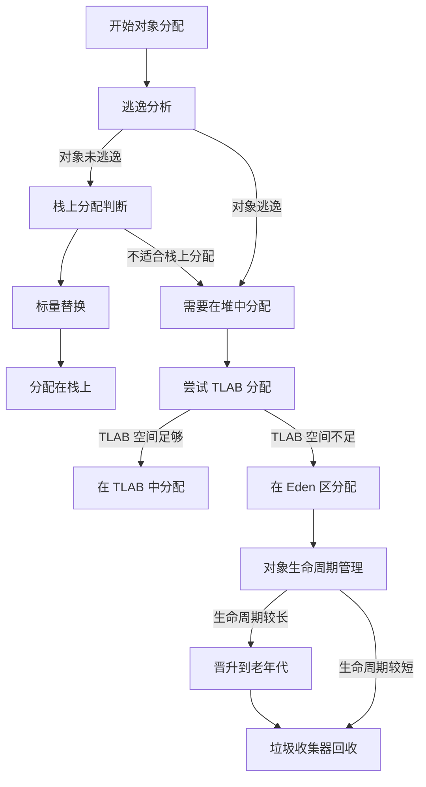

## 对象的分配流程

JVM 在对象分配时，通常遵循以下流程：

1. **逃逸分析**：JIT 编译器分析对象的作用域，判断其是否逃逸出当前方法或线程。
2. **栈上分配判断**：如果对象未逃逸，则可能通过 **标量替换（Scalar Replacement）** 将对象拆解为基本类型变量分配在栈上。
3. **TLAB 分配**：若对象需要在堆中分配，JVM 会优先尝试在当前线程的 **TLAB（Thread Local Allocation Buffer）** 中分配。
4. **Eden 区分配**：若 TLAB 空间不足，则直接在 Eden 区进行内存分配。
5. **GC 回收**：若对象生命周期较长，可能会被晋升到老年代，最终由垃圾收集器回收。

::: question 创建对象一定分配在堆里吗？

不一定。在 Java 虚拟机中，对象的分配位置取决于 JVM 的优化机制（如逃逸分析）。具体来说：

- **默认分配**：对象通常分配在堆内存（Heap）中，因为堆是全局共享的内存区域，便于对象生命周期管理。
- **优化分配（栈上分配）**：如果 JVM 通过逃逸分析判断对象**未逃逸**（即仅在当前方法内部使用），则可能将其分配在栈帧（Stack Frame）中。栈帧是线程私有的内存区域，对象随方法调用结束自动销毁，无需垃圾回收（GC）介入，从而降低内存分配开销和 GC 压力。
- **例外情况**：如果对象**逃逸**（如被外部方法或线程访问），则必须分配在堆中。
:::

## 逃逸分析和栈上分配

### 逃逸分析（Escape Analysis）

逃逸分析（Escape Analysis）是 JVM 中的一种 **运行时优化技术**，用于分析对象的作用域和生命周期，判断其是否可以被其他线程访问或在方法之外存活。

主要逃逸类型如下：

- **未逃逸（No Escape）**：对象仅在方法内部使用，不被返回、不被外部引用。
- **方法逃逸（Method Escape）**：对象作为返回值、参数传递给其他方法。
- **线程逃逸（Thread Escape）**：对象被其他线程访问，例如赋值给静态变量、类变量或发布到多个线程中。

### 栈上分配（Scalar Replacement）

如果逃逸分析判断对象未逃逸，JVM 可以将其 **拆解为基本类型的字段** 并分配在栈帧中，这种优化称为 **标量替换（Scalar Replacement）**。

栈上分配优点：

- 减少堆内存分配，降低内存压力。
- 对象随栈帧销毁而自动回收，无需垃圾回收介入。
- 提升程序性能，特别是在高并发或频繁创建临时对象的场景中。

## TLAB（Thread Local Allocation Buffer）

- **定义**
	TLAB 是 JVM 在堆的 Eden 区中为每个线程预先分配的一块 **私有内存缓冲区**，用于提高多线程环境下对象创建的效率。

- **设计动机**
	在多线程环境下，多个线程同时在堆上申请内存时，需要通过互斥锁（如 CAS）进行同步，这会导致性能下降。为了解决这个问题，JVM 引入了 TLAB。

- **工作机制**
	1. 每个线程在创建时会分配一个 TLAB。
	2. 对象优先尝试在当前线程的 TLAB 中分配。
	3. 若 TLAB 剩余空间足够，直接分配，不加锁。
	4. 若 TLAB 空间不足，JVM 尝试分配新的 TLAB 或在 Eden 区公共部分分配。
	5. TLAB 分配失败时，可能触发 **同步锁机制** 或 **GC 调整 TLAB 大小**。

- **TLAB 的优化范围**
	- **仅优化内存分配过程**：TLAB 的线程安全性仅体现在内存分配阶段，保证多个线程可以高效地分配对象。
	- **不影响对象的线程安全**：对象是否线程安全取决于其本身的使用方式，与是否通过 TLAB 分配无关。

