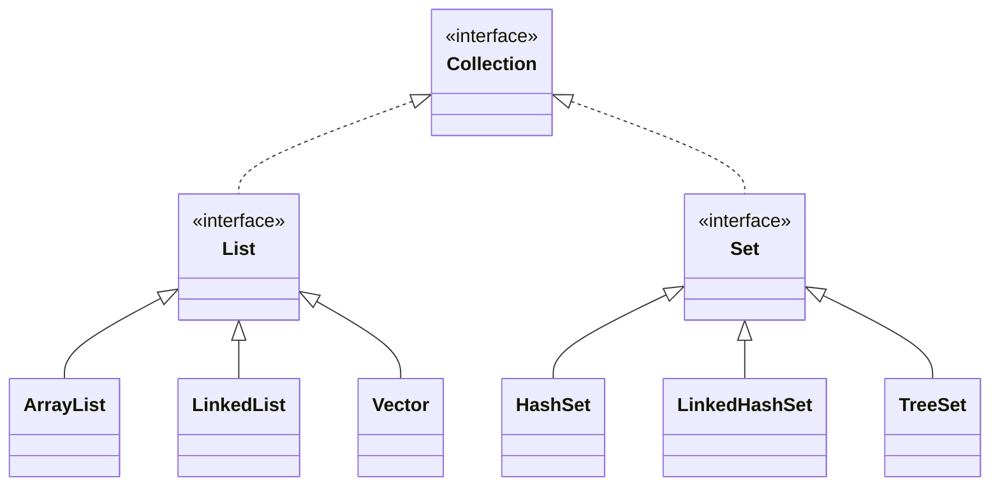
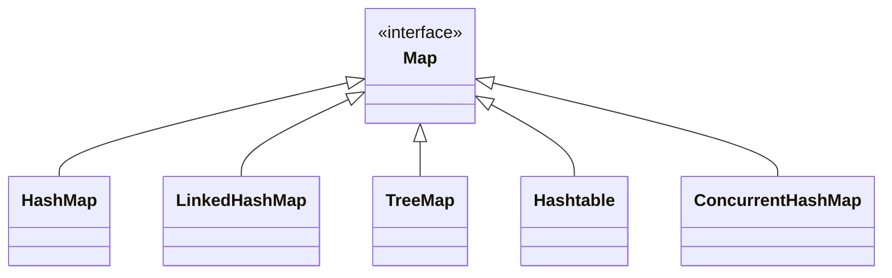

## 集合体系结构

Java 集合框架主要分为两大类：`Collection` 单列集合和 `Map` 双列集合。

### Collection 单列集合

`Collection` 接口是单列集合的根接口，它定义了所有单列集合通用的操作。常见的实现类有：

* `List` 接口：元素有序、可重复。
    * `ArrayList`：基于动态数组实现，查询快，增删慢。
    * `LinkedList`：基于双向链表实现，增删快，查询慢。
    * `Vector`：`ArrayList` 的线程安全版本，性能较低。
* `Set` 接口：元素无序、不可重复。
    * `HashSet`：基于 `HashMap` 实现，不保证元素顺序。
    * `LinkedHashSet`：基于 `LinkedHashMap` 实现，保持元素插入顺序。
    * `TreeSet`：基于红黑树实现，元素有序（自然排序或定制排序）。



### Map 双列集合

`Map` 接口是双列集合的根接口，它存储键值对 (Key-Value Pair)，键唯一，值可重复。常见的实现类有：

* `HashMap`：基于哈希表实现，不保证键值对顺序。
* `LinkedHashMap`：基于哈希表和双向链表实现，保持键值对插入顺序。
* `TreeMap`：基于红黑树实现，键有序（自然排序或定制排序）。
* `Hashtable`：`HashMap` 的线程安全版本，性能较低。
* `ConcurrentHashMap`：线程安全的 `HashMap`，性能优于 `Hashtable`。



## ArrayList

### 扩容机制

当添加元素时，若当前元素数量达到内部数组容量上限，将触发扩容：

1. **计算新容量**：新容量通常为原容量的 1.5 倍（通过 `oldCapacity + (oldCapacity >> 1)` 位运算实现），并检查是否超过 `Integer.MAX_VALUE - 8` 的最大容量限制。
2. **分配新数组**：根据新容量创建新数组。
3. **数据迁移**：使用 `Arrays.copyOf()` 将原数组元素复制到新数组。
4. **引用更新**：将内部数组引用指向新数组。
5. **完成扩容**：继续执行元素添加操作。

## CopyOnWriteArrayList

### 实现原理

`CopyOnWriteArrayList` 是一种“写时复制”的并发容器，其核心原理如下：

1. **底层存储**：`CopyOnWriteArrayList` 内部也是使用数组来存储元素。
2. **读写分离**：
    * **读操作**：所有的读操作（如 `get()`、`iterator()`）都不加锁，直接访问当前数组。这意味着读操作可以并发进行，且不会被写操作阻塞。
    * **写操作**：当进行写操作（如 `add()`、`set()`、`remove()` 等）时，`CopyOnWriteArrayList` 会：
        1. **加锁**：对写操作加 `ReentrantLock` 锁，确保同一时间只有一个线程能进行写操作。
        2. **复制新数组**：将当前数组复制一份，得到一个新数组。
        3. **在新数组上修改**：在新数组上执行修改操作（添加、删除或修改元素）。
        4. **替换旧数组**：修改完成后，将内部的数组引用指向这个新数组。
        5. **释放锁**。

### 优缺点

- **优点**：
	* **读性能极高**：由于读操作不加锁，可以完全并发执行，因此在读多写少的场景下，`CopyOnWriteArrayList` 具有非常高的读取性能。
	* **线程安全**：通过写时复制和写操作加锁，保证了并发修改的线程安全性。

- **缺点**：
	* **内存开销大**：每次写操作都会复制整个底层数组，如果数组较大，会产生较大的内存开销。
	* **数据不是实时最新**：读操作读取的是旧数组，因此可能读到的是在写操作开始之前的数据，而不是最新的数据。对于实时性要求非常高的场景不适用。
	* **写性能相对较低**：写操作涉及数组复制和加锁，性能相对较低。

- **适用场景**：`CopyOnWriteArrayList` 最适合于读操作远远多于写操作的并发场景，例如事件监听器列表、配置信息列表等。

## HashMap

### 底层的数据结构

`HashMap` 的底层数据结构在不同 JDK 版本中有所演变：

* **JDK 1.7 及以前**：
    `HashMap` 的底层是 **数组 + 链表**。
    数组被称为“桶数组” (Bucket Array)，每个数组元素是一个链表的头节点。当发生哈希冲突时，新元素会以链表的形式添加到冲突位置。
* **JDK 1.8 及以后**：
    `HashMap` 的底层是 **数组 + 链表 + 红黑树**。
    在 JDK 1.8 中，当同一个桶位上的链表长度达到一定阈值 (默认为 8)，并且数组长度达到一定阈值 (默认为 64) 时，链表会转换为红黑树。当红黑树的节点数量减少到一定阈值时 (默认为 6)，会重新退化为链表。引入红黑树是为了在极端哈希冲突情况下，将查找、插入、删除操作的时间复杂度从 `O(n)` 优化到 `O(log n)`。

### 添加元素流程 (`put` 方法)

当调用 `map.put(key, value)` 方法时，`HashMap` 添加元素的流程如下：

1. **计算哈希值和索引**：
    * 首先，计算 `key` 的 `hashCode()`。
    * 然后，将 `hashCode()` 值进行一次扰动处理（`hash()` 方法），以减少哈希冲突的概率。
    * 最后，通过 `(数组长度 - 1) & hash值` 的位运算，计算出元素在底层数组中应存入的下标位置（桶索引）。
2. **检查桶位是否为空**：
    * 如果计算出的桶位置为 `null`，表示该位置没有元素，直接将 `key-value` 对封装成 `Node` 对象（或 `Entry` 对象，JDK 1.7）并存入该位置。
3. **处理哈希冲突**：
    * 如果桶位置不为 `null`，说明发生了哈希冲突，该位置已经存在元素（链表或红黑树的头节点）。
    * **遍历链表/红黑树**：
        * 会遍历该桶位置下的链表或红黑树，依次比较现有元素的 `key` 和待插入 `key`：
            * 首先比较 `key` 的哈希值是否相等。
            * 如果哈希值相等，再调用 `key.equals()` 方法比较 `key` 是否完全一致。
        * **键已存在**：如果找到一个键与待插入键完全一致的元素，则会用新的 `value` 覆盖原有元素的 `value`，并返回旧的 `value`。
        * **键不存在**：如果遍历完整个链表或红黑树，都没有找到一致的键，则将新元素添加到链表或红黑树中。
            * **JDK 1.7**：采用**头插法**将新节点插入到链表头部。
            * **JDK 1.8**：采用**尾插法**将新节点插入到链表尾部。
4. **链表转红黑树（JDK 1.8 特有）**：
    * 在 JDK 1.8 中，如果当前桶位下的链表长度（`TREEIFY_THRESHOLD`，默认为 8）且底层数组的长度（`MIN_TREEIFY_CAPACITY`，默认为 64）达到或超过阈值，链表会转换为红黑树，以优化查找性能。
5. **判断是否需要扩容**：
    * 每次成功插入元素后，`HashMap` 会检查当前元素数量是否超过了阈值 (`threshold = capacity * loadFactor`)。
    * 如果超过阈值，`HashMap` 会触发扩容操作，将底层数组的容量翻倍，并重新计算所有元素的哈希值和位置，将它们重新分布到新的数组中。

## ConcurrentHashMap

`ConcurrentHashMap` 在不同 JDK 版本中的实现原理有所不同，但核心思想都是通过降低锁粒度来提高并发性能。

-  **JDK 1.7 版本**
	* **分段锁 (Segment)**：JDK 1.7 的 `ConcurrentHashMap` 采用**分段锁**的机制。它将整个 `HashMap` 分割成多个小的 `Segment`（段），每个 `Segment` 都是一个独立的 `HashEntry` 数组，并且维护自己的锁。
	* **并发访问**：默认情况下有 16 个 `Segment`，每个 `Segment` 独立加锁。这意味着最多可以有 16 个线程同时操作 `ConcurrentHashMap` 的不同 `Segment`，从而大大降低了锁竞争，提高了并发性能。
	* **底层结构**：每个 `Segment` 内部仍然是 **数组 + 链表** 的结构。

- **JDK 1.8 版本**
	* **去掉了分段锁**：JDK 1.8 彻底放弃了分段锁的设计，转而采用 **CAS (Compare-And-Swap) + `synchronized`** 的方式来实现更加细粒度的锁。
	* **底层结构**：`ConcurrentHashMap` 在 JDK 1.8 的底层结构是 **数组 + 链表 + 红黑树**，与 `HashMap` 的 JDK 1.8 实现类似。
	* **并发处理流程**：
	    1. **初始化数组**：如果底层数组为空，使用 **CAS** 操作来初始化数组。
	    2. **插入元素**：
	        * 首先计算 `key` 的哈希值，定位到对应的桶位。
	        * **空桶位**：如果桶位为空，则使用 **CAS** 设置桶上的头节点。
	        * **非空桶位**：如果桶位不为空，则使用 **`synchronized` 锁**锁定该桶位上的头节点。
	            * 在 `synchronized` 块内，遍历桶中的数据（链表或红黑树），比较 `key`。
	            * 如果找到相同的 `key`，则替换 `value`。
	            * 如果没有找到相同的 `key`，则新增节点到链表或红黑树中。
	            * 之后，判断链表长度是否达到阈值（8），如果达到且数组长度也达到阈值（64），则将链表转换为红黑树。
	    3. **扩容**：扩容操作也是通过 CAS 协作完成的，并且支持多线程协同扩容。

::: note JDK 1.8 的优点

* **锁粒度更细**：锁的粒度从整个 `Segment` 缩小到单个桶位（链表/红黑树的头节点），进一步减少了锁竞争的概率，提高了并发度。
* **优化了哈希冲突处理**：引入红黑树，在链表过长时提升了查询性能。
* **整体性能提升**：在大多数场景下，JDK 1.8 版本的 `ConcurrentHashMap` 提供了比 JDK 1.7 更好的并发性能。

这种设计体现了对**无锁化编程**和**锁粒度细化**的优化思想，是 Java 并发容器的经典实现。

:::

## 总结

### 为什么 `new ArrayList<>()` 时建议指定初始化容量值？

在创建 `ArrayList` 时，建议指定初始化容量值是为了优化性能和内存使用。

* **避免扩容开销**：`ArrayList` 的底层是动态数组。当元素数量超出当前容量时，`ArrayList` 会进行扩容。扩容操作涉及到内存分配和数据复制，是相对耗时的。
* **提高性能**：如果能够预估 `ArrayList` 将要存储的元素数量，并设置一个合适的初始容量，就可以在很大程度上避免或减少扩容的次数，从而减少性能损耗。
* **避免内存浪费**：虽然扩容会创建更大的数组，但如果初始容量设置过大，而实际存储的元素远少于此，则会造成内存的浪费。通过合理设置初始容量，可以在性能和内存之间取得平衡。

因此，当知道 `ArrayList` 大致的元素数量时，指定初始化容量是一个良好的实践。

### 为什么默认情况下 `ArrayList` 的扩容机制是扩容为原数组的 1.5 倍？

`ArrayList` 默认的扩容因子为 1.5 倍（即 `oldCapacity + (oldCapacity >> 1)`），这是在内存使用和性能之间进行权衡的经验值，适用于大多数应用场景。

* **过大的扩容因子**：如果扩容因子过大，虽然可以减少扩容次数，但可能导致一次性分配过多的内存，如果这些内存未被完全使用，就会造成内存浪费。
* **过小的扩容因子**：如果扩容因子过小，会增加扩容的频率。频繁的扩容操作（创建新数组和数据复制）会带来显著的性能开销。
* **1.5 倍的平衡**：1.5 倍的扩容因子被认为是相对平衡的选择。它既能有效减少扩容的频率，降低因频繁扩容带来的性能损耗，又能避免一次性分配过多未使用的内存，从而在性能和内存效率之间取得较好的折衷。

###  `ArrayList` 是线程安全的吗？

`ArrayList` **不是线程安全的**。

如果 `ArrayList` 作为多线程共享的数据（例如单例对象的成员变量、静态变量等），并且有多个线程对其进行并发修改操作（如 `add()`、`remove()` 等），就可能出现线程不安全的问题：

* **数据覆盖**：多个线程同时 `add()` 元素时，可能导致元素覆盖或丢失。
* **数据不一致**：在扩容过程中，一个线程正在复制数据，另一个线程可能访问到不完整或不正确的数据。
* **`IndexOutOfBoundsException`**：在并发修改时可能抛出数组越界异常。

**解决方案**：

1. **使用 `Collections.synchronizedList()`**：
    ```java
    List<String> synchronizedList = Collections.synchronizedList(new ArrayList<>());
    ```

    这种方法通过在每个方法上加 `synchronized` 锁来保证线程安全，但锁粒度较大，性能开销也较大。

2. **使用 `CopyOnWriteArrayList`**：
    `CopyOnWriteArrayList` 是 `java.util.concurrent` 包下提供的线程安全的 `List` 实现。

### `HashMap` 默认的加载因子为什么是 `0.75` ？

当 `HashMap` 中存储的元素数量达到当前容量的 75% 时，`HashMap` 就会进行扩容。

选择 `0.75` 作为加载因子是基于**泊松分布**的统计学规律和性能与内存之间的权衡：

* **减少哈希冲突**：当加载因子为 0.75 时，哈希冲突的概率相对较低，能够有效保持 `HashMap` 的平均查找时间复杂度接近 `O(1)`。如果加载因子过大，哈希冲突的概率会增加，可能导致链表过长，降低查询效率。
* **控制内存占用**：如果加载因子过小，`HashMap` 会更频繁地扩容，导致底层数组的容量增长得更快，从而占用更多的内存空间。
* **最佳平衡点**：`0.75` 是经过大量实验和统计分析得出的一个经验值，它被认为是能在减少哈希冲突（保持 `O(1)` 的平均时间复杂度）和控制内存占用之间达到最佳平衡的折中值。

### `HashMap` 在扩容时，为什么会将底层数组的容量扩容为原来的 2 倍？

HashMap 之所以选择将容量扩容为原来的 2 倍，主要是为了**维持其内部数组长度始终为 2 的幂次方**。这样做有两个核心好处：

1. **提高性能**：`HashMap` 定位桶位置的传统方法是 `key.hashCode() % 数组长度`，但 `%` 取模运算的性能是比较低的。当数组长度是 2 的幂次方时，可以用**位运算 `&`** 来代替**取模运算 `%`** 计算元素下标，位运算的效率远高于取模，这是性能上的一个关键优化。
    
2. **降低哈希冲突**：`(长度 - 1)` 的二进制会是一个全 1 的“掩码”（比如长度 16，掩码就是 1111）。用它和 key 的 `hashCode` 做 `&` 运算，能充分利用 `hashCode` 的低位信息，让数据分布更均匀，从而减少冲突。

所以，扩容为 2 倍，就是为了在容量增长时，能够简单地保持住‘2 的幂次方’这个关键特性，以确保性能和效率。

### `HashMap` 是线程安全的吗？

`HashMap` **不是线程安全的**。

如果 `HashMap` 作为多线程共享的数据（例如单例对象的成员变量、静态变量等），并且有多个线程对其进行并发修改操作（如 `put()`、`remove()` 等），就可能出现线程不安全的问题：

* **JDK 1.7 中的问题**：在 JDK 1.7 中，`HashMap` 在多线程环境下扩容时，由于采用**头插法**，并发修改可能导致链表形成**环形结构**（死循环），进而导致 CPU 占用 100% 或在获取元素时陷入死循环。也可能导致数据丢失。
* **JDK 1.8 中的问题**：在 JDK 1.8 中，虽然采用了**尾插法**避免了环形链表，但在多线程并发 `put()` 操作时，仍可能出现数据覆盖（例如两个线程同时向空桶插入元素，后一个线程覆盖前一个线程的数据）或在扩容时丢失元素的问题。

**解决方案**：

1. **使用 `Collections.synchronizedMap()`**：
    ```java
    Map<String, String> synchronizedMap = Collections.synchronizedMap(new HashMap<>());
    ```

    这种方法通过在每个方法上加 `synchronized` 锁来保证线程安全，但锁粒度较大（锁住整个 `Map` 对象），并发性能较差。

2. **使用 `ConcurrentHashMap`**：
    `ConcurrentHashMap` 是 `java.util.concurrent` 包下提供的线程安全的 `Map` 实现，它提供了比 `Collections.synchronizedMap()` 更好的并发性能。

### 为什么 `ConcurrentHashMap` 在 JDK 1.8 中要结合使用 CAS 和 `synchronized` 来保证线程安全？

`ConcurrentHashMap` 在 JDK 1.8 中采用 **CAS 和 `synchronized` 结合**的方式来保证线程安全，而不是全部使用其中一种，这是基于对不同操作的特性和开销的精准考量，体现了**无锁优先，锁为补充**的现代并发编程思想。

具体来说，我们可以分两种场景来看：

- **低竞争或无竞争场景，优先使用 CAS**
	- **场景**：初始化数组、以及向空的桶位插入第一个节点。
	- **为什么用 CAS**：这是一个**非常快、冲突概率极低**的操作。使用 CAS 这种无锁技术，可以通过一次原子操作完成节点插入，它不会导致线程挂起和上下文切换，开销极小，性能最高。

- **高竞争或已存在冲突的场景，切换为 `synchronized`**
	- **场景**：当桶位不为空时，需要遍历修改桶下的链表或红黑树。
	- **为什么这时用 `synchronized`**：因为后续的操作变得**复杂且耗时**（比如遍历链表、旋转红黑树），竞争的可能性大大增加。
	    - **保证复杂操作的原子性**：这些操作不是一步能完成的，必须用锁来保护。
	    - **避免了 CAS 在高竞争下的性能缺陷**：如果对一个已经冲突的桶继续使用 CAS，多个线程会疯狂自旋重试，大量空耗 CPU 资源。而 `synchronized` 会让失败的线程进入阻塞，让出 CPU，在高竞争下反而是一种更合理的策略。

