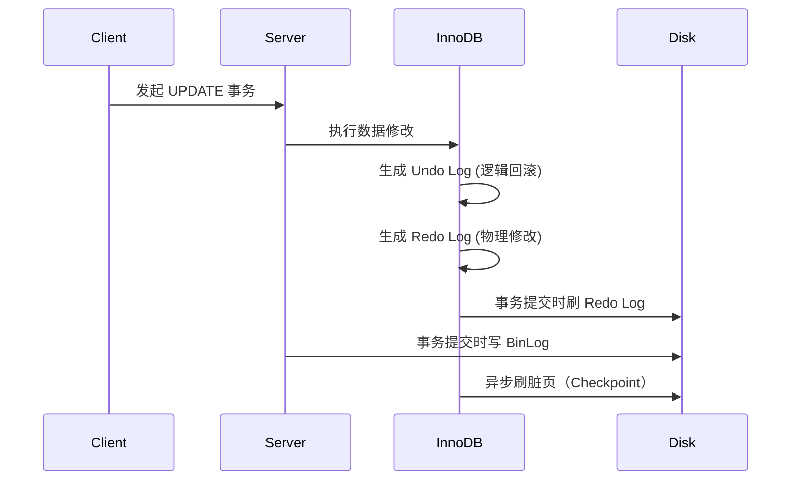

## 日志层级与作用域

| 日志类型   | 所属层级       | 作用引擎       | 核心用途                     |
|------------|----------------|----------------|------------------------------|
| **Redo Log** | 存储引擎层     | 仅 InnoDB      | 保证事务持久性               |
| **Undo Log** | 存储引擎层     | 仅 InnoDB      | 事务原子性 & MVCC 支持       |
| **BinLog**   | Server 层      | 所有引擎       | 数据备份/主从同步/灾难恢复 |

## Redo Log（重做日志）

Redo Log 是 InnoDB 存储引擎用于保证事务 **持久性 (Durability)** 的核心机制。它属于**物理日志**，记录的是数据页在磁盘上的物理修改（页号 + 偏移量 + 修改内容），而不是 SQL 语句。

### Redo Log 保证事务持久性的原理

#### 1. WAL 技术

直接刷盘痛点：

1. **性能问题**：每次数据修改都需磁盘 I/O（随机写），效率极低
2. **持久性风险**：异步刷盘时崩溃会导致内存脏页丢失

为了平衡数据安全与系统性能，InnoDB 采用了 **预写日志 (Write-Ahead Logging, WAL)** 技术。当数据发生变更时，InnoDB 不会立即将修改后的数据页（称为脏页）写入磁盘，取而代之的步骤是：

1. **记录日志**: 首先将数据的物理修改内容记录到 Redo Log 中。
2. **日志刷盘**: 在事务提交时，确保 Redo Log 被成功写入磁盘。
3. **延迟刷盘**: 内存中的脏页则会在后续某个时间点由后台线程异步刷回磁盘。

#### 2. 崩溃恢复流程

- **崩溃前**：有些脏页可能还停留在内存中，还没刷到磁盘。
- **崩溃后**：数据库重启时，InnoDB 会扫描 Redo Log：
    - 如果发现日志里记录了某个事务的完整提交信息，就用日志对数据文件进行 **重做 (redo)**，恢复事务修改过的数据页，确保数据不会丢失。
    - 如果日志记录不完整（事务未提交），则直接丢弃。

这样，Redo Log 通过 **先写日志，再写数据** 的策略，确保了事务提交的持久性。

#### 3. Redo Log 与 BinLog 的配合

- InnoDB 事务提交时会同时写 **Redo Log**（存储引擎层，保证崩溃恢复）和 **BinLog**（Server 层，保证复制和归档）。
- 为避免主从不一致，MySQL 采用 **两阶段提交 (Two-Phase Commit, 2PC)** 协调 Redo Log 和 BinLog：
    1. **prepare 阶段**：写入 Redo Log 并标记为 prepare 状态。
    2. **写 BinLog**：生成事务对应的 BinLog 并刷盘。
    3. **commit 阶段**：将 Redo Log 状态修改为 commit，事务提交完成。

这样即使在 **BinLog 已写成功但 Redo Log 未提交** 或 **Redo Log 已提交但 BinLog 未写成功** 的场景下，也能通过恢复逻辑避免数据不一致。

## Undo Log（回滚日志）

Undo Log 是 InnoDB 存储引擎的逻辑日志，主要承担两大核心职责：保证事务的 **原子性 (Atomicity)** 和支持 **多版本并发控制 (MVCC)**。

### Undo Log 保证事务原子性的原理

Undo Log 记录了与数据修改操作完全相反的逻辑操作。

- 当执行 `INSERT` 时，它记录一条对应的 `DELETE`。
- 当执行 `UPDATE` 时，它记录一个将数据恢复到修改前版本的 `UPDATE`。
- 当执行 `DELETE` 时，它记录一条对应的 `INSERT`。

如果事务执行过程中发生错误或用户主动执行 `ROLLBACK`，InnoDB 就会利用 Undo Log 执行反向操作，将数据恢复至事务开始前的状态，从而保证事务的原子性。

  ```mermaid
  graph LR
    A[当前数据行] --> B[最新Undo Log]
    B -->|roll_pointer| C[旧版本Undo Log]
    C -->|roll_pointer| D[更旧版本...]
  ```

### Undo Log 支持 MVCC 的原理

当一行数据被修改时，InnoDB 会将该行的旧版本数据存入 Undo Log，并通过数据行中的隐藏字段 `roll_pointer` (回滚指针) 将所有历史版本串联起来，形成一个 **版本链**。

当一个读事务（`SELECT`）启动时，InnoDB 会为其创建一个读视图（Read View）。在读取数据时，InnoDB 会沿着版本链，根据读视图的规则找到对当前事务可见的那个版本，从而实现非阻塞的并发读取。

## BinLog（二进制日志）

BinLog 是 MySQL Server 层的归档日志，记录了所有对数据库表结构（DDL）和表数据（DML）进行修改的操作。它不记录 `SELECT` 或 `SHOW` 等查询操作。

### BinLog 的主要用途

- **主从复制**: Master 节点将 BinLog 事件传输给 Slave 节点，Slave 通过重放这些事件来达到与 Master 数据一致的效果。
- **数据恢复**: 可用于基于时间点的精确恢复。通过结合全量备份文件和指定时间段内的 BinLog，可以将数据库恢复到任意时刻的状态。

### BinLog 的写入时机

事务提交时，Server 层会将该事务中的所有操作写入 BinLog。

### BinLog 的三种格式对比

| 格式            | 记录内容                 | 优点            | 缺点                                      | 应用场景     |
| ------------- | -------------------- | ------------- | --------------------------------------- | -------- |
| **Statement** | SQL 原文               | 日志量小          | 主从不一致风险（如使用 `NOW()` 等时间函数，导致主从同步后数据不相同） | 基本弃用     |
| **Row**       | 行数据变更（前/后镜像）         | 数据一致性 100% 保证 | 日志体积大，网络 I/O 高                          | 强一致性场景   |
| **Mixed**     | 自动选择 Statement 或 Row | 性能与一致性平衡      | 仍需人工监控                                  | 生产环境默认配置 |

## 日志协作流程



::: note

Redo Log 与 BinLog 通过**两阶段提交（2PC）** 保证一致性，先写 Redo Log（prepare）→ 写 BinLog → 提交 Redo Log（commit）。

:::

## 总结

### 直接刷脏页和写入 Redo Log 不都是一次磁盘 IO 吗？为什么选择后者？

刷脏页和写 Redo Log 虽然都涉及一次磁盘 IO，但代价完全不同：

1. 刷脏页是随机写，写整页；Redo Log 是顺序写，写量小。
2. Redo Log 可以先落盘保证事务持久性，再异步、批量地刷脏页，提高并发性能。
3. 即使宕机，Redo Log 也能恢复数据，直接刷脏页做不到。

所以数据库普遍采用 “先写日志 (WAL)，再刷脏页” 的机制。

### 事务执行流程

以 UPDATE 为例，假设执行 SQL 语句：

```sql
UPDATE accounts SET balance = balance - 100 WHERE id = 1;
```

1. InnoDB 在内存中找到 `id=1` 所在的数据页，并修改其 `balance` 字段。
2. 生成一条 Redo Log，记录：“在数据页 A 的偏移量 B 处，将值从 500 修改为 400”。
3. 事务提交时，将这条 Redo Log 写入磁盘。
4. 若此时数据库崩溃，即使包含 `id=1` 的数据页尚未刷盘，重启后 InnoDB 依然能通过 Redo Log 恢复此次修改，保证数据的持久性。
