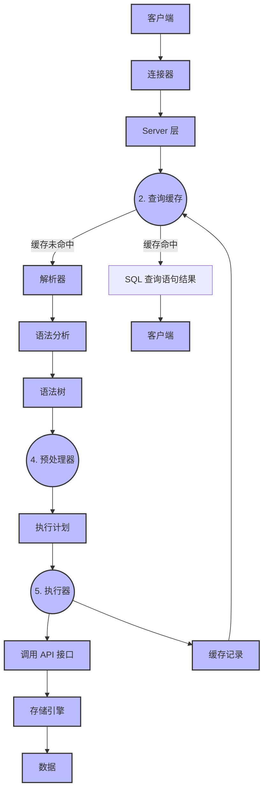

## 查询语句执行过程
### 执行一条 SQL 查询语句，期间发生了什么？
1. **连接器**：建立连接，管理连接、校验用户身份。
2. **查询缓存**：查询语句如果命中查询缓存则直接返回，否则继续往下执行。（MySQL 8.0 已删除该模块）
3. **解析 SQL**：通过解析器对 SQL 查询语句进行词法分析、语法分析，以构建语法树，方便后续模块读取表名、字段、语句类型。
4. **执行 SQL**：执行 SQL 共有三个阶段：
	- **预处理阶段**：检查表或字段是否存在，并将 `select *` 中的 `*` 符号扩展为表上的所有列。
	- **优化阶段**：基于查询成本的考虑， 选择查询成本最小的执行计划；
	- **执行阶段**：根据执行计划执行 SQL 查询语句，从存储引擎读取记录，返回给客户端；

### 联表查询的注意事项有哪些？如何避免慢查询？

联表查询 (JOIN) 是关系型数据库中常见的操作，但如果使用不当，极易引发性能问题，导致慢查询。在编写和使用联表查询时，主要有以下注意事项：

1. **明确 `JOIN` 类型，避免笛卡尔积**：
    
    - 务必在 `JOIN` 子句中提供明确的关联条件 (`ON` 子句)。如果没有关联条件，`CROSS JOIN` 会产生笛卡尔积，其结果集的行数是所有表的行数之积，会造成巨大的性能开销。
        
2. **为关联字段建立索引**：
    
    - 这是最核心的优化原则。在 `ON` 子句和 `WHERE` 子句中涉及的关联字段和过滤字段，都应该建立索引。MySQL 在执行 `JOIN` 时，会选择一个驱动表 (Driving Table)，然后用驱动表的结果集去关联被驱动表 (Driven Table)，在被驱动表的关联字段上建立索引，可以极大地提升查询效率。
        
3. **小表驱动大表 (Small Table Drives Big Table)**：
    
    - 在 `INNER JOIN` 中，查询优化器通常会自动选择成本更低的执行计划。但在 `LEFT JOIN` 或 `RIGHT JOIN` 中，驱动表的选择是固定的。应尽量选择结果集更小的表作为驱动表。如果无法直接判断，可以使用 `EXPLAIN` 分析查询计划，确保小结果集驱动大结果集。
        
4. **`JOIN` 的表数量不宜过多**：
    
    - 阿里巴巴的开发规范中建议，`JOIN` 的表数量不应超过三张。因为每增加一个 `JOIN`，查询优化器需要分析的执行计划组合就会呈指数级增长，增加了复杂性，也更容易出错。过多的 `JOIN` 也会使查询逻辑变得难以维护。
        
5. **`SELECT` 子句只选择必要的字段**：
    
    - 避免使用 `SELECT *`。只查询业务逻辑中需要的字段，可以减少网络传输的数据量，降低 I/O 开销。如果查询的字段都包含在索引中（覆盖索引），则可以避免回表查询，性能会得到显著提升。
        
6. **在 `JOIN` 前进行数据筛选**：
    
    - 尽可能在 `WHERE` 子句中提前过滤掉不需要的数据，减少参与 `JOIN` 操作的数据量。可以通过子查询或 `WITH` 子句 (CTE) 先对大表进行预处理，再进行 `JOIN`。
        
7. **`JOIN` 字段的类型和字符集保持一致**：
    
    - 如果关联字段的数据类型、长度或字符集不一致，MySQL 可能无法有效利用索引，会进行隐式的类型转换，导致索引失效。

