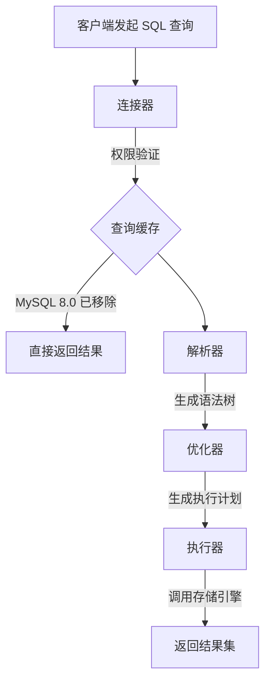

## 查询执行流程

当 MySQL 数据库接收到一条 SQL 查询语句时，会依次经过以下核心组件和阶段：

### 1. 连接器（Connector）

- **功能**：
	- 建立与客户端的网络连接（支持 TCP/IP、Socket 等协议）。
	- 验证用户身份及权限（基于用户名、密码和主机信息）。
	- 管理连接池（包括长连接/短连接的维护和超时控制）。
- **关键点**：
	- 连接建立后，权限验证仅依赖初始读取的权限快照。
	- 长连接需定期重置避免内存泄漏（通过 `mysql_reset_connection()`）。

### 2. 查询缓存（Query Cache）

- **历史行为**：
	- 对完全匹配的 SQL 语句，尝试返回缓存结果（Key-Value 结构，Key 为 SQL 原文）。
	- 若表数据变更，关联的所有缓存自动失效。
- **移除原因（MySQL 8.0 起默认禁用并彻底移除该模块）**：
	- 缓存命中率低（OLTP 场景更新频繁）。
	- 全局锁竞争影响并发性能。

### 3. 解析器（Parser）

- **处理流程**：
	- **词法分析**：拆分 SQL 语句为原子 Token（如识别 `SELECT`、`FROM` 等关键字）。
	- **语法分析**：基于语法规则构建抽象语法树（AST）。
- **错误处理**：
	- 语法错误在此阶段抛出（如缺少引号、错误关键字等）。

### 4. 优化器（Optimizer）

- **核心作用**：
	- 选择最优执行计划（如索引选择、JOIN 顺序、子查询优化）。
	- 基于成本模型（Cost Model）评估不同方案。
- **典型决策**：
	- 全表扫描 vs 索引扫描。
	- 嵌套循环连接（Nested-Loop Join） vs 哈希连接（Hash Join）。

### 5. 执行器（Executor）

- **执行逻辑**：
	- 调用存储引擎接口，按优化器生成的执行计划逐步获取数据。
	- 执行前二次验证用户对目标表的操作权限。
- **交互流程**：
	- 通过 `Handler API` 与存储引擎（如 InnoDB）交互。
	- 逐行处理数据并聚合结果集（如排序、分组操作）。

### 6. 结果返回（Result Return）

- **输出阶段**：
	- 将最终结果集通过连接器返回客户端。
	- 结果集可能分批次传输（受 `max_allowed_packet` 限制）。
- **资源清理**：
	- 临时表释放、线程状态重置等收尾操作。

### 流程总结

## 总结

::: question 执行一条 SQL 查询语句，期间发生了什么？

1. **连接器**：建立连接，管理连接、校验用户身份。
2. **查询缓存**（MySQL 8.0 已删除该模块）：查询语句如果命中查询缓存则直接返回，否则继续往下执行。
3. **解析 SQL**：通过解析器对 SQL 查询语句进行词法分析、语法分析，以构建语法树，方便后续模块读取表名、字段、语句类型。
4. **执行 SQL**：执行 SQL 共有三个阶段：
	- **预处理阶段**：检查表或字段是否存在，并将 `select *` 中的 `*` 符号扩展为表上的所有列。
	- **优化阶段**：基于查询成本的考虑， 选择查询成本最小的执行计划。
	- **执行阶段**：根据执行计划执行 SQL 查询语句，从存储引擎读取记录，返回给客户端。

:::
