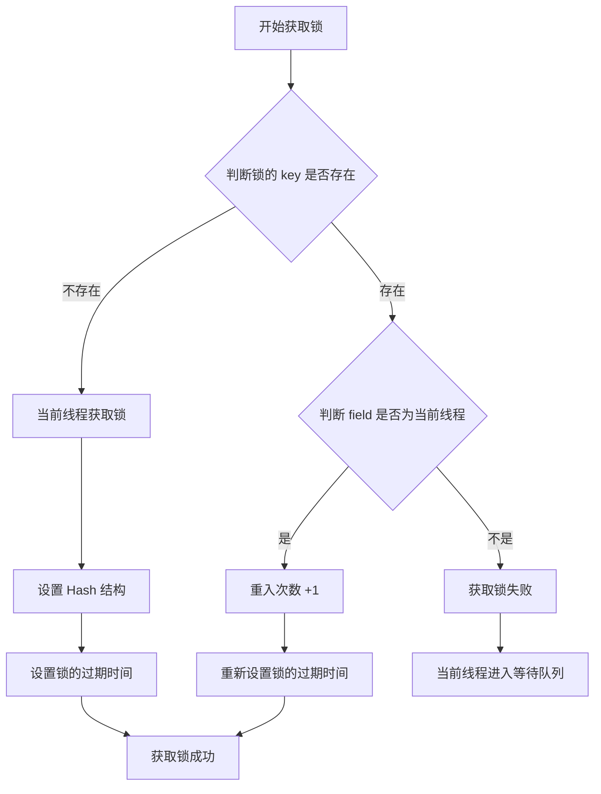
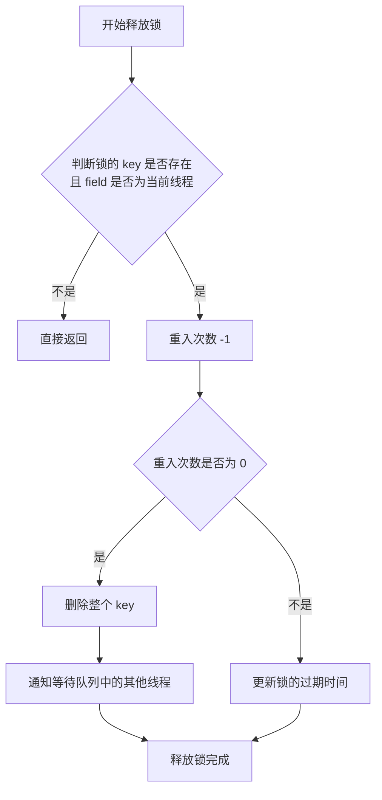
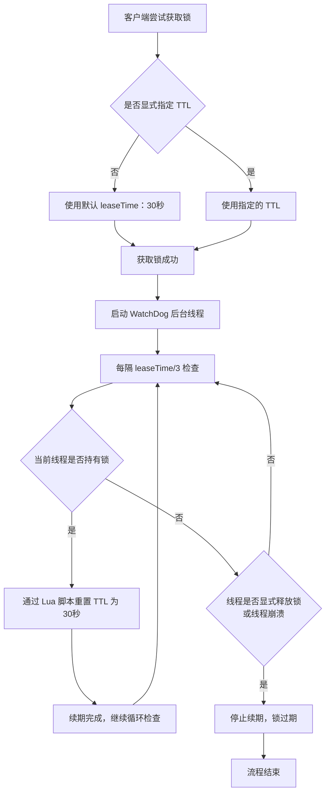

## 基于 Redis 的 `SET NX EX PX` 命令

### 实现原理

基于 Redis 的 `SET` 命令并结合如下参数，可以实现一个简单的分布式锁。

- `NX`：只在键不存在时设置
- `EX`：设置键的过期时间，单位秒
- `PX`：设置键的过期时间，单位毫秒

### 加锁操作

```bash
SET unique_key "clientId+threadId" NX EX TTL
```
- **参数说明**：
    - `unique_key`：业务唯一标识
    - `NX`：仅当 Key 不存在时设置
    - `EX`：设置过期时间（秒）
    - `TTL`：锁自动释放时间（秒）
- **结果**：
    - 返回 `1`/`ok`：加锁成功
    - 返回 `0`/`nil`：加锁失败（锁已被占用）

### 释放锁操作

释放锁需要确保是当前持有锁的客户端才能释放，以防止误删。

1.  **获取锁的 `value`**：首先 `GET unique_key` 获取当前锁的 `value`。
2.  **判断归属**：将获取到的 `value` 与当前客户端的 `unique_value`（机器码 + 线程 ID）进行比较。
3.  **条件删除**：
    * 如果两者匹配，说明是当前客户端持有的锁，执行 `DEL unique_key` 命令释放锁。
    * 如果两者不匹配，说明锁已被其他客户端持有或已过期被其他客户端获取，当前客户端不应执行删除操作。

::：example 锁提前释放导致并行

- **场景**：
    1. 线程 1 获取锁，因业务阻塞未及时释放。
    2. 锁 TTL 到期，Redis 自动删除键，锁释放，线程 2 获取锁。
    3. 线程 1 恢复运行，未检查锁归属，直接删除锁。
    4. 线程 3 获取锁，与线程 2 并行执行，导致数据不一致或并发问题。
        
- **解决方案**：在释放锁前检查锁的值是否为当前线程的标识符（如 `Thread1_ID`），确保只有锁的持有者才能删除锁。

```mermaid
sequenceDiagram
	participant Redis as Redis
    participant Thread1 as 线程1
    participant Thread2 as 线程2
    participant Thread3 as 线程3

    Thread1->>Redis：获取锁
    Redis-->>Thread1：锁获取成功
    Note over Thread1：业务阻塞开始
    Note over Redis：TTL 到期，自动删除 key (锁释放)
    Thread2->>Redis：获取锁
    Redis-->>Thread2：锁获取成功
    Thread2->>Thread2：执行业务逻辑
    Note over Thread1：阻塞结束，恢复运行
    alt 无判断，直接删除锁
        Thread1->>Redis：删除 key (误删线程2的锁)
        Redis-->>Thread1：删除成功 (锁释放)
        Thread3->>Redis：获取锁
        Redis-->>Thread3：锁获取成功
        Note over Thread2,Thread3：并发执行，问题发生
    end
```

:::

### 原子性保证（Lua 脚本）

为了防止在“判断锁归属”和“删除锁”这两个操作之间，锁因过期而被其他客户端获取，导致误删，这两个操作必须是原子性的。Redis 保证原子性的最佳实践是使用 Lua 脚本。

::：example 锁检查与删除的非原子性导致并行

- **场景**：
    1. 线程 1 获取锁，检查锁归属后因 Full GC 阻塞。
    2. 锁 TTL 到期，Redis 删除键，锁释放，线程 2 获取锁。
    3. 线程 1 恢复运行，因之前已检查锁归属，直接删除锁（误删线程 2 的锁）。
    4. 线程 3 获取锁，与线程 2 并行执行，导致并发问题。
        
- **解决方案**：使用 Redis Lua 脚本原子性地执行锁归属检查和删除操作，确保检查与删除之间无中断，防止误删。

```mermaid
sequenceDiagram
	participant Redis as Redis
    participant Thread1 as 线程1
    participant Thread2 as 线程2
    participant Thread3 as 线程3

    Thread1->>Redis：获取锁
    Redis-->>Thread1：锁获取成功
    Note over Thread1：业务逻辑执行
    Thread1->>Redis：检查 key=lock_key 的值
    Redis-->>Thread1：返回 value=Thread1_ID (锁归属确认)
    Note over Thread1：因 Full GC 阻塞
    Note over Redis：TTL 到期，自动删除 key (锁释放)
    Thread2->>Redis：获取锁
    Redis-->>Thread2：锁获取成功
    Thread2->>Thread2：执行业务逻辑
    Note over Thread1：阻塞结束，恢复运行
    alt 非原子性操作
        Thread1->>Redis：删除 key=lock_key (误删线程2的锁)
        Redis-->>Thread1：删除成功 (锁释放)
        Thread3->>Redis：获取锁
        Redis-->>Thread3：锁获取成功
        Note over Thread2,Thread3：并发执行，问题发生
    end
```

:::

### 存在的问题

1. **业务执行耗时过长导致锁提前释放**：如果业务逻辑执行时间超过了锁的 `TTL`，锁会自动释放，其他线程可能会获取到锁，导致多个线程并行执行，违反了锁的互斥性。
2. **不可重入性**：基于 `SET NX EX` 实现的锁是不可重入的。如果同一个线程在持有锁的情况下再次尝试获取锁，会因为 `NX` 规则而失败。
3. **`TTL` 设置困难**：合理设置 `TTL` 是一个挑战。`TTL` 过短可能导致锁提前释放，`TTL` 过长则可能增加死锁的风险（尽管有自动过期）。业务执行时间的不确定性使得精确设置 `TTL` 变得困难。
4. **主从架构下的数据不一致问题 (Redisson 解决方案)**：在 Redis 主从复制架构中，如果客户端在主节点上成功获取锁，但在锁数据同步到从节点之前主节点宕机，且从节点被提升为新的主节点，那么新的主节点上将不存在该锁，其他客户端可能会再次获取到锁，导致锁失效。

## 基于 Redisson 的分布式锁

Redisson 是一个功能强大且成熟的 Java 版 Redis 客户端，提供了多种分布式对象和服务，包括分布式锁。它解决了原生 `SET NX EX` 方案的诸多痛点。

### Redisson 可重入锁原理

Redisson 的分布式锁默认是可重入的，这意味着同一个线程可以多次获取同一把锁，而不会造成死锁。

#### 实现方式

Redisson 利用 Redis 的 Hash 结构来记录锁的持有者和重入次数。

* **Hash 结构**：`key` (锁的名称) -> `field` (客户端 ID + 线程 ID) -> `value` (重入次数)。

#### 获取锁的逻辑

Redisson 内部通过 Lua 脚本实现原子性操作：

* 判断锁的 `key` 是否存在（即是否有线程持有锁）。
* 如果 `key` 不存在，说明当前没有线程持有锁，则当前线程成功获取锁。此时，设置 Hash 结构：`HSET key (clientId + ":" + threadId) 1`，并设置锁的过期时间。
* 如果 `key` 存在，说明已有线程持有锁。
	* 判断持有锁的 `field`（客户端 ID + 线程 ID）是否是当前线程。
	* 如果是当前线程，则重入次数加 1：`HINCRBY key (clientId + ":" + threadId) 1`，并重新设置锁的过期时间。
	* 如果不是当前线程，则获取锁失败，当前线程进入等待队列。



#### 释放锁的逻辑

Redisson 同样通过 Lua 脚本实现原子性操作：

* 判断锁的 `key` 是否存在，以及持有锁的 `field` 是否是当前线程。
* 如果不是当前线程持有锁，则直接返回，不进行任何操作。
* 如果是当前线程持有锁，则将重入次数减 1：`HINCRBY key (clientId + ":" + threadId) -1`。
* 如果重入次数减为 0，说明当前线程完全释放了锁，则删除整个 `key`，释放锁资源，并通知等待队列中的其他线程尝试获取锁。
* 如果重入次数不为 0，仅更新过期时间（因为锁仍然被当前线程持有）。



### 超时续约机制（看门狗 WatchDog）

Redisson 引入了“看门狗”机制来解决原生 `SET NX EX` 方案中 `TTL` 设置困难和锁提前释放的问题。

#### 机制原理

1.  当 Redisson 客户端获取锁时，如果未显式指定 `TTL`，Redisson 会默认使用一个 `leaseTime`（默认 30 秒）。
2.  Redisson 会启动一个后台线程（WatchDog），它是一个定时任务。
3.  这个后台线程会每隔 `leaseTime / 3`（默认 10 秒）检查一次当前线程是否仍然持有该锁。
4.  如果锁仍然被当前线程持有，WatchDog 会通过 Lua 脚本重置锁的 `TTL`，将其延长至默认的 `leaseTime`（30 秒）。这个过程被称为“续期”。
5.  这个续期过程会一直持续，直到当前线程显式释放锁，或者线程崩溃导致无法续期。

这样，即使业务执行时间非常长，只要线程没有崩溃，锁就不会因为 `TTL` 到期而被强制释放，从而保证了锁的有效性，避免了锁提前释放导致的多线程并行问题。



### 主从架构下的数据不一致问题及解决方案

即使有了 Redisson 的看门狗机制，在 Redis 主从复制架构下，仍然存在数据一致性问题，即主节点宕机但锁数据未同步到从节点时，可能导致锁失效。

#### 问题重述

在 Redis 主从复制架构中，Redisson 分布式锁可能面临数据未同步导致的线程安全问题。具体表现为：

1. **主节点宕机与数据丢失**：当 Redisson 客户端在 Redis 主节点上成功获取锁后，如果该锁数据尚未及时同步到从节点，此时主节点发生宕机。
2. **新主节点选举与锁失效**：原主节点宕机后，一个从节点会被提升为新的主节点。由于新主节点没有同步到原主节点上的锁数据，它会认为该锁处于未被占用的状态。
3. **重复加锁与线程安全隐患**：此时，其他客户端或线程可能会在新主节点上重新获取到本应已被占用的锁，导致多个线程同时持有同一个逻辑锁，从而破坏了分布式锁的互斥性，引发严重的线程安全问题。

#### 解决方案

为了解决这个问题，Redisson 提供了两种高级的分布式锁方案：`RedissonMultiLock` (联锁) 和 `RedissonRedLock` (红锁)。

1.  **`RedissonMultiLock` (联锁)**
    * **条件**：只有当在**所有** Redis 实例上都成功获取锁时，整个联锁才算成功。
    * **失败处理**：如果在任何一个实例上获取锁失败，或者在获取过程中出现异常，它会立即释放所有已经成功获取的锁，并宣告联锁失败。
    * **优点**：提供了最高的安全性，只要有一个 Redis 实例正常工作，就能保证锁的互斥性。
    * **缺点**：性能开销较大，且可用性相对较低（任何一个实例故障都可能导致联锁失败）。

2.  **`RedissonRedLock` (红锁)**
    * **条件**：客户端尝试在**所有** Redis 实例上并行获取锁。当且仅当在**大多数**（N/2 + 1）Redis 实例上成功获取锁时，且获取锁的总耗时小于锁的有效时间，才认为成功获取红锁。
    * **失败处理**：如果未能获取到大多数锁，或者获取锁耗时过长，客户端会立即释放所有已经成功获取的锁。
    * **优点**：提供了比单实例更高的可用性和安全性，即使少量 Redis 实例故障，也能保证锁的正常工作。
    * **缺点**：部署和维护成本更高，需要多个独立的 Redis 实例。在极端网络分区情况下，仍然可能存在理论上的风险（尽管概率极低）。

这两种方案通过在多个独立的 Redis 节点上进行操作，大大增强了分布式锁的健壮性和可靠性，解决了单点故障带来的数据不一致问题。