## 6.1 逻辑存储结构

InnoDB 存储引擎的逻辑结构从大到小依次为：表空间 (Tablespace)、段 (Segment)、区 (Extent)、页 (Page)、行 (Row)。

![[1.存储引擎_附件/1.存储引擎-20250729152625542.png]]

*   **表空间 (Tablespace)**：
    是 InnoDB 存储引擎逻辑结构的最高层。如果启用了 `innodb_file_per_table` 参数 (在 MySQL 8.0 中默认开启)，则每张表都会有一个独立的表空间，即 `.ibd` 文件。一个 MySQL 实例可以对应多个表空间，用于存储记录、索引等数据。

*   **段 (Segment)**：
    分为数据段 (Leaf node segment)、索引段 (Non-leaf node segment) 和回滚段 (Rollback segment)。InnoDB 是索引组织表，数据段就是 B+ 树的叶子节点，索引段即为 B+ 树的非叶子节点。段用来管理多个区 (Extent)。

*   **区 (Extent)**：
    表空间的单元结构，每个区的大小为 1MB。默认情况下，InnoDB 存储引擎页大小为 16KB，即一个区中一共有 64 个连续的页。

*   **页 (Page)**：
    是 InnoDB 存储引擎磁盘管理的最小单元，每个页的大小默认为 16KB。为了保证页的连续性，InnoDB 存储引擎每次从磁盘申请 4-5 个区。

*   **行 (Row)**：
    InnoDB 存储引擎数据是按行进行存放的。每行数据默认有两个隐藏字段：
    *   `Trx_id`：每次对某条记录进行改动时，都会把对应的事务 id 赋值给 `trx_id` 隐藏列。
    *   `Roll_pointer`：每次对某条记录进行改动时，都会把旧的版本写入到 undo 日志中，然后这个隐藏列就相当于一个指针，可以通过它来找到该记录修改前的信息。

## 6.2 架构

### 6.2.1 概述

MySQL 5.5 版本开始，默认使用 InnoDB 存储引擎。它擅长事务处理，具有崩溃恢复特性，在日常开发中使用非常广泛。InnoDB 架构图分为内存结构和磁盘结构两部分。

![[6.InnoDB引擎_附件/6.InnoDB引擎-20250804142317795.png]]

### 6.2.2 内存结构

主要的内存结构包括：`Buffer Pool`、`Change Buffer`、`Adaptive Hash Index` 和 `Log Buffer`。

#### 6.2.2.1 Buffer Pool

InnoDB 存储引擎基于磁盘文件存储，为了尽可能弥补磁盘 I/O 效率的不足，需要把经常使用的数据加载到缓冲池中，避免每次访问都进行磁盘 I/O。InnoDB 的缓冲池中不仅缓存了索引页和数据页，还包含了 Undo 页、插入缓存、自适应哈希索引以及 InnoDB 的锁信息等。

缓冲池是主内存中的一个区域，里面可以缓存磁盘上经常操作的真实数据。在执行增删改查操作时，先操作缓冲池中的数据 (若缓冲池没有数据，则从磁盘加载并缓存)，然后再以一定频率刷新到磁盘，从而减少磁盘 I/O，加快处理速度。

缓冲池以页 (Page) 为单位，底层采用链表数据结构管理页。根据状态，将 Page 分为三种类型：

*   `free page`：空闲 page，未被使用。
*   `clean page`：被使用 page，数据没有被修改过。
*   `dirty page`：脏页，被使用 page，数据被修改过，也即数据与磁盘的数据产生了不一致。

在专用服务器上，通常将多达 80% 的物理内存分配给缓冲池。`innodb_buffer_pool_size` 参数用于设置缓冲池大小。

```sql
SHOW VARIABLES LIKE 'innodb_buffer_pool_size';
```

#### 6.2.2.2 Change Buffer

更改缓冲区，针对非唯一二级索引页。在执行 DML 语句时，如果这些数据 Page 没有在 Buffer Pool 中，不会直接操作磁盘，而是会将数据变更存在更改缓冲区 Change Buffer 中，在未来数据被读取时，再将数据合并恢复到 Buffer Pool 中，再将合并后的数据刷新到磁盘中。使用 Change Buffer 可以在缓冲池中进行合并处理，减少磁盘 I/O。

理解 Change Buffer 的意义，需要先理解二级索引的结构。二级索引通常是非唯一的，并且以相对随机的顺序插入。删除和更新操作可能影响索引树中不相邻的二级索引页。如果每次都操作磁盘，会造成大量的磁盘 I/O。

#### 6.2.2.3 Adaptive Hash Index

自适应 Hash 索引，用于优化对 Buffer Pool 数据的查询。虽然 InnoDB 引擎中没有直接支持 Hash 索引，但是 InnoDB 提供了自适应 Hash 索引的功能。因为 Hash 索引在进行等值匹配时，一般性能要高于 B+ 树（Hash 索引只需要一次 I/O）。但是 Hash 索引不适合做范围查询、模糊匹配等。

InnoDB 存储引擎会监控对表上各索引页的查询，如果观察到在特定的条件下 Hash 索引可以提升速度，则建立 Hash 索引，称之为自适应 Hash 索引。

自适应哈希索引，无需人工干预，是系统根据情况自动完成的。`adaptive_hash_index` 参数用于控制是否开启自适应哈希索引。

#### 6.2.2.4 Log Buffer

日志缓冲区，用来保存要写入到磁盘中的 Log 日志数据 (Redo Log, Undo Log)。默认大小为 16MB，日志缓冲区的日志会定期刷新到磁盘中。如果需要更新、插入或删除许多行的事务，增加日志缓冲区的大小可以节省磁盘 I/O。

`innodb_log_buffer_size` 参数用于设置日志缓冲区大小。`innodb_flush_log_at_trx_commit` 参数用于控制日志刷新到磁盘的时机，主要包含以下三个值：

- `1`：日志在每次事务提交时写入并刷新到磁盘，默认值。
- `0`：每秒将日志写入并刷新到磁盘一次。
- `2`：日志在每次事务提交后写入，并每秒刷新到磁盘一次。

### 6.2.3 磁盘结构

InnoDB 的磁盘结构主要包括：`System Tablespace` (系统表空间)、`File-Per-Table Tablespaces` (独立表空间)、`General Tablespaces` (通用表空间)、`Undo Tablespaces` (撤销表空间)、`Temporary Tablespaces` (临时表空间)、`Doublewrite Buffer Files` (双写缓冲区文件) 和 `Redo Log` (重做日志)。

#### 6.2.3.1 System Tablespace

系统表空间是更改缓冲区的存储区域。如果表是在系统表空间而不是每个表文件或通用表空间中创建的，它也可能包含表和索引数据。(在 MySQL 5.x 版本中还包含 InnoDB 数据字典、Undo Log 等)。

`innodb_data_file_path` 参数用于配置系统表空间。系统表空间，默认的文件名叫 `ibdata1`。

#### 6.2.3.2 File-Per-Table Tablespaces

如果开启了 `innodb_file_per_table` 开关，则每个表的文件表空间包含单个 InnoDB 表的数据和索引，并存储在文件系统上的单个数据文件中。

`innodb_file_per_table` 参数用于控制是否开启独立表空间，该参数默认开启。也就是说，我们没创建一个表，都会产生一个表空间文件，即 `.ibd` 文件。

#### 6.2.3.3 General Tablespaces

通用表空间，需要通过 `CREATE TABLESPACE` 语法创建通用表空间，在创建表时，可以指定该表空间。

1. **创建表空间**
	```sql
	CREATE TABLESPACE ts_name ADD DATAFILE 'file_name.ibd' ENGINE = engine_name;
	```
2. **创建表时指定表空间**
	```sql
	CREATE TABLE XXX TABLESPACE ts_name;
	```

#### 6.2.3.4 Undo Tablespaces

撤销表空间，MySQL 实例在初始化时会自动创建两个默认的 Undo 表空间 (初始大小 16M)，用于存储 Undo Log 日志。

#### 6.2.3.5 Temporary Tablespaces

InnoDB 使用会话临时表空间和全局临时表空间。存储用户创建的临时表等数据。

#### 6.2.3.6 Doublewrite Buffer Files

双写缓冲区，InnoDB 引擎将数据页从 Buffer Pool 刷新到磁盘前，先将数据页写入双写缓冲区文件中，便于系统异常时恢复数据。

#### 6.2.3.7 Redo Log

重做日志，是用来实现事务的持久性。该日志文件由两部分组成：重做日志缓冲 (Redo Log Buffer) 以及重做日志文件 (Redo Log)，前者是在内存中，后者在磁盘中。当事务提交之后会把所有修改信息都会存到该日志中，用于在刷新脏页到磁盘时，发生错误时，进行数据恢复使用。

以循环方式写入重做日志文件时，涉及两个文件：`ib_logfile0` 和 `ib_logfile1`。

### 6.2.4 后台线程

在 InnoDB 的后台线程中，分为 4 类，分别是：`Master Thread`、`IO Thread`、`Purge Thread`、`Page Cleaner Thread`。

![[6.InnoDB引擎_附件/6.InnoDB引擎-20250804151654716.png]]

- **Master Thread**
	核心后台线程，负责调度其他线程，还负责将缓冲池中的数据异步刷新到磁盘中，保持数据的一致性，还包括脏页的刷新、合并插入缓存、Undo 页的回收。

- **IO Thread**
	在 InnoDB 存储引擎中大量使用了 AIO (Async IO) 来处理 I/O 请求，这样可以极大地提高数据库的性能，而 IO Thread 主要负责这些 I/O 请求的回调。

	可以通过 `show engine innodb status \G;` 指令，查看到 InnoDB 的状态信息，其中就包含 IO Thread 信息。

- **Purge Thread**
	主要用于回收事务已经提交了的 Undo Log。在事务提交之后，若 Undo Log 不再使用，则使用 Purge Thread 回收。

- **Page Cleaner Thread**
	协助 Master Thread 刷新脏页到磁盘的线程，它可以减轻 Master Thread 的工作压力，减少阻塞。

## 6.3 事务原理

### 6.3.1 事务基础

事务是一组操作的集合，它是一个不可分割的工作单位，事务会把所有的操作作为一个整体一起向系统提交或撤销操作请求，即这些操作要么同时成功，要么同时失败。

 事务特性如下：

* **原子性 (Atomicity)**：事务是不可分割的最小操作单元，要么全部成功，要么全部失败。
* **一致性 (Consistency)**：事务完成时，必须使所有的数据都保持一致状态。
* **隔离性 (Isolation)**：数据库系统提供的隔离机制，保证事务在不受外部并发操作影响的独立环境下运行。
* **持久性 (Durability)**：事务一旦提交或回滚，它对数据库中的数据的改变就是永久的。

 InnoDB 对事务特性的实现原理：

![[6.InnoDB引擎_附件/6.InnoDB引擎-20250804153253446.png]]

- **原子性、一致性、持久性**：通过 `redo log`（重做日志）和 `undo log`（回滚日志）共同保障。
- **隔离性**：通过数据库锁机制和多版本并发控制（MVCC）实现。

### 6.3.2 Redo Log

Redo Log 记录事务提交时数据页的物理修改，用于实现事务的持久性。它由两部分组成：

- Redo Log Buffer (重做日志缓冲区)：位于内存中。
	修改数据时，先将变更写入 Redo Log Buffer。
- Redo Log File (重做日志文件)：位于磁盘中。
	事务提交时，将 buffer 内容刷新至 Redo Log File（顺序写入磁盘）。

InnoDB 引擎先操作缓冲池中的数据，如果缓冲区没有对应的数据，会通过后台线程将磁盘中的数据加载出来，然后将缓冲池中的数据修改，修改后的数据页称为脏页。脏页会在一定的时机刷新到磁盘，但不是实时刷新，如果刷新过程出错，可能导致数据丢失，无法保证持久性。

![[6.InnoDB引擎_附件/6.InnoDB引擎-20250804153631985.png]]

对缓冲区的数据进行增删改之后，会首先将操作的数据页的变化，记录在 Redo Log Buffer 中。在事务提交时，会将 Redo Log Buffer 中的数据刷新到 Redo Log 磁盘文件中。如果在刷新缓冲区的脏页到磁盘时发生错误，此时就可以借助于 Redo Log 进行数据恢复，这样就保证了事务的持久性。如果脏页成功刷新到磁盘或者涉及到的数据已经落盘，此时 Redo Log 就没有作用了，就可以删除了，所以存在的两个 Redo Log 文件是循环写的。

![[6.InnoDB引擎_附件/6.InnoDB引擎-20250804153729890.png]]

每次提交事务时，都要刷新 Redo Log 到磁盘，而不是直接将 Buffer Pool 中的脏页刷新到磁盘。这是因为业务操作通常是随机读写磁盘，而 Redo Log 是顺序写入磁盘，顺序写的效率远高于随机写。

### 6.3.3 Undo Log

Undo Log 记录数据修改前的信息，用于事务回滚（保障原子性）和多版本并发控制（MVCC）。它记录了数据被修改前的信息，是一种逻辑日志。

当 `DELETE` 一条记录时，Undo Log 会记录一条对应的 `INSERT` 记录；当 `INSERT` 一条记录时，Undo Log 会记录一条对应的 `DELETE` 记录；当 `UPDATE` 一条记录时，Undo Log 会记录一条对应相反的 `UPDATE` 记录。当执行 `ROLLBACK` 时，就可以从 Undo Log 中读取逻辑记录并进行回滚。

Undo Log 在事务执行时产生，事务提交时不会立即删除，因为可能被 MVCC 使用。Undo Log 采用段 (segment) 的方式管理，存放在 rollback segment (回滚段) 中，每个回滚段包含 1024 个 undo log segment。

## 6.4 MVCC

### 6.4.1 基本概念

**当前读**是指读取数据的最新版本，并且在读取时会对记录加锁，以防止其他并发事务修改。常见的当前读操作包括：

- `SELECT ... LOCK IN SHARE MODE` (共享锁)
- `SELECT ... FOR UPDATE`、`UPDATE`、`INSERT`、`DELETE` (排他锁)

::: example 

在 `RR` 隔离级别下，事务 A 可以读取到事务 B 最新提交的内容，这是因为使用了 `LOCK IN SHARE MODE` 共享锁，执行的是当前读操作。

::: tabs

@tab 事务 A

```shell
mysql> begin;
Query OK, 0 rows affected (0.00 sec)

mysql> select * from stu lock in share mode;
+----+-------+-----+
| id | name  | age |
+----+-------+-----+
|  1 | adam  |   1 |
|  3 | cat   |   3 |
| 11 | jetty |  11 |
| 19 | lei   |  19 |
| 25 | luci  |  25 |
+----+-------+-----+
5 rows in set (0.00 sec)
```

@tab 事务 B

```shell
mysql> begin;
Query OK, 0 rows affected (0.00 sec)

mysql> update stu set name = 'adam' where id = 1;
Query OK, 1 row affected (0.00 sec)
Rows matched: 1  Changed: 1  Warnings: 0

mysql> commit;
Query OK, 0 rows affected (0.00 sec)
```

:::

与当前读相对的是**快照读**，快照读读取的是数据的可见版本，可能是历史版本，不会加锁，属于非阻塞读。

不同隔离级别下，快照读的行为有所不同：

- **READ COMMITTED (RC)**：每次 `SELECT` 都生成一个新的快照读。
- **REPEATABLE READ (RR)**：事务中第一个 `SELECT` 语句才是快照读，后续的 `SELECT` 语句都从该快照中读取数据。
- **SERIALIZAVBLE**：快照读会退化为当前读。

::: example 

即使事务 B 提交了数据，事务 A 中也查询不到，这是因为普通的 `SELECT` 是快照读。在 `RR` 隔离级别下，事务中第一个 `SELECT` 语句确定了快照版本，后续的 `SELECT` 语句都从该快照中获取数据，从而保证了可重复读。

::: tabs

@tab 事务 A

```shell
mysql> begin;
Query OK, 0 rows affected (0.00 sec)

mysql> select * from stu;
+----+-------+-----+
| id | name  | age |
+----+-------+-----+
|  1 | adam  |   1 |
|  3 | cat   |   3 |
| 11 | jetty |  11 |
| 19 | lei   |  19 |
| 25 | luci  |  25 |
+----+-------+-----+
5 rows in set (0.00 sec)

mysql> select * from stu;
+----+-------+-----+
| id | name  | age |
+----+-------+-----+
|  1 | adam  |   1 |
|  3 | cat   |   3 |
| 11 | jetty |  11 |
| 19 | lei   |  19 |
| 25 | luci  |  25 |
+----+-------+-----+
5 rows in set (0.00 sec)
```

@tab 事务 B

```shell
mysql> begin;
Query OK, 0 rows affected (0.00 sec)

mysql> update stu set name = 'carl' where id = 1;
Query OK, 1 row affected (0.00 sec)
Rows matched: 1  Changed: 1  Warnings: 0

mysql> commit;
Query OK, 0 rows affected (0.00 sec)
```

:::

**MVCC (Multi-Version Concurrency Control)**，即多版本并发控制，通过维护数据的多个版本来实现读写操作的并发执行，从而减少锁的竞争。快照读是 MySQL 实现 MVCC 的关键，它提供了一种非阻塞的读取数据的方式。MVCC 的实现依赖于数据库记录中的隐藏字段、`Undo Log` 日志和 `ReadView`。

### 6.4.2 隐藏字段

InnoDB 的表中除了定义的字段外，还有额外的三个隐藏字段：

| 字段名          | 说明                                                                 |
| --------------- | ------------------------------------------------------------------- |
| `DB_TRX_ID`     | 最近修改事务 ID，记录插入这条记录或最后一次修改该记录的事务 ID。    |
| `DB_ROLL_PTR`   | 回滚指针，指向这条记录的上一个版本，用于配合 Undo Log，指向上一个版本。 |
| `DB_ROW_ID`     | 隐藏主键，如果表结构没有指定主键，将会生成该隐藏字段。              |

`DB_ROW_ID` 只有在没有主键的情况下才会添加。

::: example 有主键的表

使用 `ibd2sdi stu.ibd` 命令可以查看 `.ibd` 文件中的表结构信息。

在表结构信息的 `columns` 部分，可以找到隐藏字段的信息。从输出结果中可以看到 `DB_TRX_ID` 和 `DB_ROLL_PTR` 两个隐藏字段。

```json :collapsed-lines
{
	"name": "DB_TRX_ID",
	"type": 10,
	"is_nullable": false,
	"is_zerofill": false,
	"is_unsigned": false,
	"is_auto_increment": false,
	"is_virtual": false,
	"hidden": 2,
	"ordinal_position": 4,
	"char_length": 6,
	"numeric_precision": 0,
	"numeric_scale": 0,
	"numeric_scale_null": true,
	"datetime_precision": 0,
	"datetime_precision_null": 1,
	"has_no_default": false,
	"default_value_null": true,
	"srs_id_null": true,
	"srs_id": 0,
	"default_value": "",
	"default_value_utf8_null": true,
	"default_value_utf8": "",
	"default_option": "",
	"update_option": "",
	"comment": "",
	"generation_expression": "",
	"generation_expression_utf8": "",
	"options": "",
	"se_private_data": "table_id=1146;",
	"engine_attribute": "",
	"secondary_engine_attribute": "",
	"column_key": 1,
	"column_type_utf8": "",
	"elements": [],
	"collation_id": 63,
	"is_explicit_collation": false
}
```

```json :collapsed-lines
{
	"name": "DB_ROLL_PTR",
	"type": 9,
	"is_nullable": false,
	"is_zerofill": false,
	"is_unsigned": false,
	"is_auto_increment": false,
	"is_virtual": false,
	"hidden": 2,
	"ordinal_position": 5,
	"char_length": 7,
	"numeric_precision": 0,
	"numeric_scale": 0,
	"numeric_scale_null": true,
	"datetime_precision": 0,
	"datetime_precision_null": 1,
	"has_no_default": false,
	"default_value_null": true,
	"srs_id_null": true,
	"srs_id": 0,
	"default_value": "",
	"default_value_utf8_null": true,
	"default_value_utf8": "",
	"default_option": "",
	"update_option": "",
	"comment": "",
	"generation_expression": "",
	"generation_expression_utf8": "",
	"options": "",
	"se_private_data": "table_id=1146;",
	"engine_attribute": "",
	"secondary_engine_attribute": "",
	"column_key": 1,
	"column_type_utf8": "",
	"elements": [],
	"collation_id": 63,
	"is_explicit_collation": false
}
```

因为该表有主键，所以没有 `DB_ROW_ID` 隐藏字段。

:::

::: example 无主键的表

创建一个无主键的表：

```sql
create table employee (id int , name varchar(10));
```

此时再使用 `ibd2sdi` 命令查看表结构，就可以发现 `DB_ROW_ID` 隐藏字段。

```json :collapsed-lines
{
	"name": "DB_ROW_ID",
	"type": 10,
	"is_nullable": false,
	"is_zerofill": false,
	"is_unsigned": false,
	"is_auto_increment": false,
	"is_virtual": false,
	"hidden": 2,
	"ordinal_position": 3,
	"char_length": 6,
	"numeric_precision": 0,
	"numeric_scale": 0,
	"numeric_scale_null": true,
	"datetime_precision": 0,
	"datetime_precision_null": 1,
	"has_no_default": false,
	"default_value_null": true,
	"srs_id_null": true,
	"srs_id": 0,
	"default_value": "",
	"default_value_utf8_null": true,
	"default_value_utf8": "",
	"default_option": "",
	"update_option": "",
	"comment": "",
	"generation_expression": "",
	"generation_expression_utf8": "",
	"options": "",
	"se_private_data": "table_id=1147;",
	"engine_attribute": "",
	"secondary_engine_attribute": "",
	"column_key": 1,
	"column_type_utf8": "",
	"elements": [],
	"collation_id": 63,
	"is_explicit_collation": false
}
```

:::

### 6.4.3 Undo Log

#### 6.4.3.1 介绍

回滚日志 (Undo Log) 是在执行 `INSERT`、`UPDATE` 和 `DELETE` 操作时产生的，用于数据回滚的日志。

- 对于 `INSERT` 操作，产生的 Undo Log 只在回滚时需要，事务提交后可以立即删除。
- 对于 `UPDATE` 和 `DELETE` 操作，产生的 Undo Log 不仅在回滚时需要，在快照读 (Snapshot Read) 时也需要，因此不会立即被删除。

#### 6.4.3.2 版本链

版本链 (Version Chain) 是指由于多个事务并发修改同一条记录，导致该记录的 Undo Log 形成的一条链表，用于实现多版本并发控制 (MVCC)。

以一个原始数据表为例，该表结构包含以下列：

| `id` | `age` | `name` | `DB_TRX_ID` | `DB_ROLL_PTR` |
| --- | --- | --- | --- | --- |
| `30` | `30` | `A30` | `1` | `null` |

- `DB_TRX_ID`：代表最近修改事务 ID，记录插入这条记录或最后一次修改该记录的事务 ID，是自增的。
- `DB_ROLL_PTR`：回滚指针，指向 Undo Log 链表中的上一个版本。由于初始数据是新插入的，尚未被更新，因此该字段值为 `null`。

现有四个并发事务同时访问这张表，时序图如下：

```mermaid
gantt
    dateFormat X
    axisFormat %s

    section 事务2
    开始事务 :active, t2_start, 0, 1
    修改 id=30,age=3: t2_update, 1, 3
    提交事务 : t2_commit, 3, 4

    section 事务3  
    开始事务 :active, t3_start, 0, 1
    修改 id=30,name=A3 : t3_update, 4, 6
    提交事务 : t3_commit, 7, 8

    section 事务4
    开始事务 :active, t4_start, 0, 1
    查询 id=30 :t4_select1, 1, 2
    修改 id=30,age=10 : t4_update, 8, 10
    查询 id=30 :t4_select2, 10, 11
    提交事务 : t4_commit, 13, 14

    section 事务5
    开始事务 :active, t5_start, 0, 1
    查询 id=30 :t5_select1, 6, 7
    查询 id=30 :t5_select2, 12, 13
```


**事务执行过程：**
1. **事务 2 修改数据：**
	- 事务 2 执行 `UPDATE` 语句，将 `id=30` 的记录的 `age` 字段修改为 `3`。
	- 在修改之前，会记录 Undo Log 日志，保存数据变更之前的样子。
	- 更新记录，记录本次操作的事务 ID (`DB_TRX_ID`) 和回滚指针 (`DB_ROLL_PTR`)，回滚指针指向 Undo Log 中保存的旧版本数据。
	```mermaid
	gantt
	    dateFormat X
	    axisFormat %s
	
	    section 事务2
	    开始事务 :done, t2_start, 0, 1
	    修改 id=30,age=3:active, t2_update, 1, 3
	    提交事务 : t2_commit, 3, 4
	
	    section 事务3  
	    开始事务 :done, t3_start, 0, 1
	    修改 id=30,name=A3 : t3_update, 4, 6
	    提交事务 : t3_commit, 7, 8
	
	    section 事务4
	    开始事务 :done, t4_start, 0, 1
	    查询 id=30 :active, t4_select1, 1, 2
	    修改 id=30,age=10 : t4_update, 8, 10
	    查询 id=30 :t4_select2, 10, 11
	    提交事务 : t4_commit, 13, 14
	
	    section 事务5
	    开始事务 :done, t5_start, 0, 1
	    查询 id=30 :t5_select1, 6, 7
	    查询 id=30 :t5_select2, 12, 13
	```

	![[6.InnoDB引擎_附件/6.InnoDB引擎-20250804184130818.png]]

2. **事务 3 修改数据：**
	- 事务 3 执行 `UPDATE` 语句，将 `id=30` 的记录的 `name` 字段修改为 `A3`。
	- 同样，记录 Undo Log 日志，保存数据变更之前的样子。
	- 更新记录，记录本次操作的事务 ID 和回滚指针，回滚指针指向 Undo Log 中保存的旧版本数据。
	```mermaid
	gantt
	    dateFormat X
	    axisFormat %s
	
	    section 事务2
	    开始事务 :done, t2_start, 0, 1
	    修改 id=30,age=3:done, t2_update, 1, 3
	    提交事务 :done, t2_commit, 3, 4
	
	    section 事务3  
	    开始事务 :done, t3_start, 0, 1
	    修改 id=30,name=A3 :active, t3_update, 4, 6
	    提交事务 : t3_commit, 7, 8
	
	    section 事务4
	    开始事务 :done, t4_start, 0, 1
	    查询 id=30 :done, t4_select1, 1, 2
	    修改 id=30,age=10 : t4_update, 8, 10
	    查询 id=30 :t4_select2, 10, 11
	    提交事务 : t4_commit, 13, 14
	
	    section 事务5
	    开始事务 :done, t5_start, 0, 1
	    查询 id=30 :t5_select1, 6, 7
	    查询 id=30 :t5_select2, 12, 13
	```

![[6.InnoDB引擎_附件/6.InnoDB引擎-20250804184227931.png]]

3. **事务 4 修改数据：**
	- 事务 4 执行 `UPDATE` 语句，将 `id=30` 的记录的 `age` 字段修改为 `10`。
	- 同样，记录 Undo Log 日志，保存数据变更之前的样子。
	- 更新记录，记录本次操作的事务 ID 和回滚指针，回滚指针指向 Undo Log 中保存的旧版本数据。
	```mermaid

	gantt

	    dateFormat X

	    axisFormat %s

	
	    section 事务2
	    开始事务 :done, t2_start, 0, 1
	    修改 id=30,age=3:done, t2_update, 1, 3
	    提交事务 :done, t2_commit, 3, 4
	
	    section 事务3  
	    开始事务 :done, t3_start, 0, 1
	    修改 id=30,name=A3 :done, t3_update, 4, 6
	    提交事务 :done, t3_commit, 7, 8
	
	    section 事务4
	    开始事务 :done, t4_start, 0, 1
	    查询 id=30 :done, t4_select1, 1, 2
	    修改 id=30,age=10 :active, t4_update, 8, 10
	    查询 id=30 :t4_select2, 10, 11
	    提交事务 : t4_commit, 13, 14
	
	    section 事务5
	    开始事务 :done, t5_start, 0, 1
	    查询 id=30 :done, t5_select1, 6, 7
	    查询 id=30 :t5_select2, 12, 13
	```

	![[6.InnoDB引擎_附件/6.InnoDB引擎-20250804184302783.png]]

通过以上过程，我们可以发现，不同的事务或相同事务对同一条记录进行修改，会导致该记录的 Undo Log 生成一条记录版本链表。链表的头部是最新的旧记录，链表尾部是最早的旧记录。这个版本链是实现 MVCC 的关键。

### 6.4.4 ReadView

ReadView (读视图) 是快照读 SQL 执行时 MVCC 提取数据的依据，记录并维护系统当前活跃的事务 (未提交的) id。ReadView 中包含了四个核心字段：

*   `m_ids`：当前活跃的事务 ID 集合。
*   `min_trx_id`：最小活跃事务 ID。
*   `max_trx_id`：预分配事务 ID，当前最大事务 ID + 1 (因为事务 ID 是自增的)。
*   `creator_trx_id`：ReadView 创建者的事务 ID。

ReadView 中规定了版本链数据的访问规则，其中 `trx_id` 代表当前 Undo Log 版本链对应事务 ID。

| 条件                                                              | 访问权限  | 说明                    |
| :-------------------------------------------------------------- | :---- | :-------------------- |
| `trx_id == creator_trx_id`                                      | 可以访问  | 数据是当前这个事务更改的          |
| `trx_id < min_trx_id`                                           | 可以访问  | 数据已经提交了               |
| `trx_id > max_trx_id`                                           | 不可以访问 | 该事务是在 ReadView 生成后才开启 |
| `min_trx_id <= trx_id <= max_trx_id` (如果 `trx_id` 不在 `m_ids` 中) | 可以访问  | 数据已经提交                |

不同的隔离级别，生成 ReadView 的时机不同：

*   **READ COMMITTED (RC)**：在事务中每一次执行快照读时生成 ReadView。
*   **REPEATABLE READ (RR)**：仅在事务中第一次执行快照读时生成 ReadView，后续复用该 ReadView。

### 6.4.5 原理分析

#### 6.4.5.1 RC 隔离级别

RC 隔离级别下，在事务中每一次执行快照读时生成 ReadView。

为了更清晰地理解，我们来分析事务 5 中，两次快照读读取数据，是如何获取数据的。在事务 5 中，查询了两次 id 为 30 的记录，由于隔离级别为 Read Committed，所以每一次进行快照读都会生成一个 ReadView。


假设在上述并发场景中，事务 5 在某一时刻（事务 2 提交后，事务 3、4 仍未提交，事务 5 刚刚开始时）执行了对 `id=30` 记录的第一次快照读。此时，会生成一个 ReadView。

```json
{
  "m_ids": [3, 4, 5],
  "min_trx_id": 3,
  "max_trx_id": 6,
  "creator_trx_id": 5
}
```

当生成 ReadView 后，系统会根据 Undo Log 中的版本链，从最新的版本开始，逐一向上匹配记录的 `DB_TRX_ID` (事务 ID)，并与 ReadView 的访问规则进行比较，以确定可见的快照。

1. **匹配 `DB_TRX_ID` 为 4 的记录：** 这条记录对应的 `trx_id` 为 4。根据 ReadView 规则，`trx_id` 为 4 不满足任何可见性条件，继续匹配下一条。
2. **匹配 `DB_TRX_ID` 为 3 的记录：** 这条记录对应的 `trx_id` 为 3。同样 `trx_id` 为 3 不满足任何可见性条件，继续匹配下一条。
3. **匹配 `DB_TRX_ID` 为 2 的记录：** 这条记录对应的 `trx_id` 为 2。此时满足 `trx_id < min_trx_id`，这意味着事务 2 在 ReadView 生成之前就已经提交，因此它的修改是可见的。匹配终止，第一次快照读返回的数据是版本链中由事务 2 修改的那条记录

在第一次快照读之后，事务 4 仍在活跃，事务 2, 3 已经提交，并且事务 5 再次查询 `id=30` 的记录。由于 RC 隔离级别下每次快照读都生成新的 ReadView，此时事务 5 的第二次快照读将生成一个新的 ReadView。

```json
{
  "m_ids": [4, 5],
  "min_trx_id": 4,
  "max_trx_id": 6,
  "creator_trx_id": 5
}
```

系统再次从 Undo Log 的版本链，从最新的版本开始，逐一向上匹配：

1. **匹配 `DB_TRX_ID` 为 4 的记录：** 这条记录对应的 `trx_id` 为 4。如果 `trx_id` 为 4 不满足 ReadView 的可见性条件，则继续匹配下一条。
2. **匹配 `DB_TRX_ID` 为 3 的记录：** 这条记录对应的 `trx_id` 为 3。此时满足 `trx_id < min_trx_id`，这意味着事务 3 在 ReadView 生成之前就已经提交，因此它的修改是可见的。匹配终止，第二次快照读返回的数据是版本链中由事务 3 修改的那条记录。

综上所述，在 RC 隔离级别下，每次快照读都会根据当前时刻的系统状态生成新的 ReadView，并依据此 ReadView 以及 Undo Log 版本链的访问规则来确定可见的数据版本。这解释了 RC 隔离级别下可能出现不可重复读（Non-Repeatable Read）现象的原因。

#### 6.4.5 RR 隔离级别

RR 隔离级别下，仅在事务中第一次执行快照读时生成 ReadView，后续复用该 ReadView。RR 是可重复读，在一个事务中，执行两次相同的 `SELECT` 语句，查询到的结果是一样的。

```json
{
  "m_ids": [3, 4, 5],
  "min_trx_id": 3,
  "max_trx_id": 6,
  "creator_trx_id": 5
}
```

在 RR 隔离级别下，由于事务的整个生命周期内都复用首次快照读生成的 ReadView，所以 ReadView 的 `m_ids`、`min_trx_id`、`max_trx_id` 和 `creator_trx_id` 等属性在事务中保持不变。这意味着，无论外部事务如何修改并提交数据，只要这些修改在事务 5 的第一次快照读时没有被其 ReadView 视为可见，那么在事务 5 后续的快照读中，这些修改也依然不可见。
