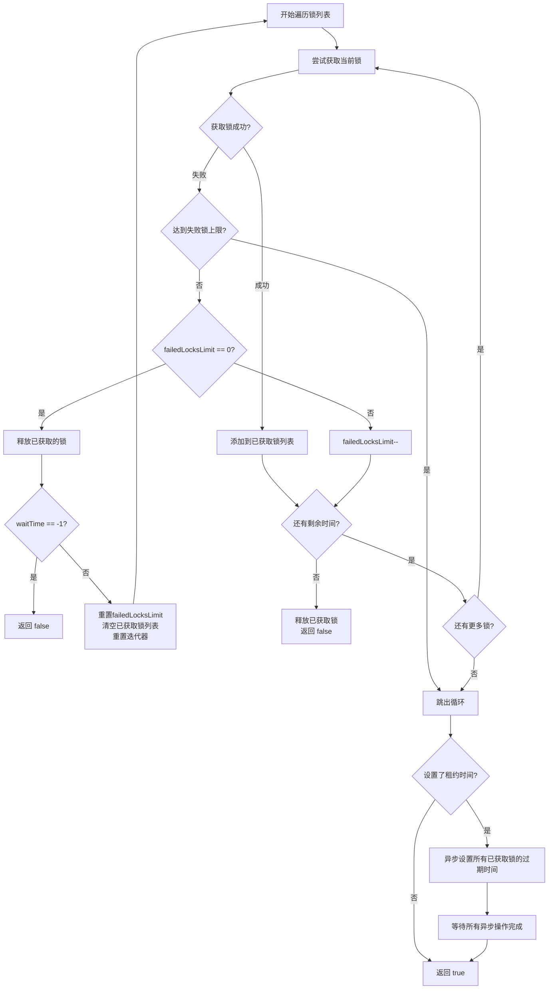

## 5.1 Redisson 功能介绍

基于 `SETNX` 实现的分布式锁存在以下问题：

*   **重入问题**：同一个线程无法多次获取同一把锁。
*   **不可重试**：获取锁时只尝试一次，失败就返回 `false`，没有重试机制。
*   **超时释放**：锁超时释放虽然可以避免死锁，但如果业务执行耗时较长，也会导致锁释放，存在 安全隐患。
*   **主从一致性**：Redis 主从集群中，主机异步同步数据到从机。若主机在同步前宕机，则可能出现锁丢失问题。

Redisson 提供了一套成熟的解决方案，它是一个基于 Redis 的 Java 驻内存数据网格，提供了多种分布式锁的实现，解决了 `SETNX` 方案的不足。

Redisson 提供了以下几种分布式锁功能：

- **可重入锁（Reentrant Lock）**：允许同一个线程多次获取同一把锁。解决了 `SETNX` 方案的重入问题。
- **公平锁（Fair Lock）**：按照请求的顺序来分配锁，避免了 " 饥饿 " 现象。
- **联锁（MultiLock）**：可以将多个 Redisson 锁组合成一个联锁，只有当所有锁都获取到时，才能执行后续操作。
- **红锁（RedLock）**：在多个 Redis 实例上尝试获取锁，只有当超过半数的实例获取成功时，才认为获取锁成功。解决了主从一致性问题，提高了锁的可用性。
- **读写锁（ReadWriteLock）**：允许多个线程同时读取共享资源，但只允许一个线程写入共享资源。提高了并发性能。

## 5.2 Redisson 快速入门

如下步骤演示了如何配置并测试 Redisson 的功能：

::: steps

1. **引入依赖：**

	```xml
	<dependency>
	    <groupId>org.redisson</groupId>
	    <artifactId>redisson</artifactId>
	    <version>3.13.6</version>
	</dependency>
	```

2. **配置 Redisson 客户端：**
	```java
	@Configuration
	public class RedissonConfig {
	
	    @Bean
	    public RedissonClient redissonClient(){
	        // 配置
	        Config config = new Config();
	        config.useSingleServer().setAddress("redis://192.168.150.101:6379")
	            .setPassword("123321");
	        // 创建 RedissonClient 对象
	        return Redisson.create(config);
	    }
	}
	```

	以上代码展示了如何通过配置类创建一个 Redisson 客户端，并将其注册为一个 Bean，方便在其他地方注入使用。其中，`config.useSingleServer()` 方法用于配置单节点 Redis 服务器的连接信息，包括地址和密码。

3. **使用 Redisson 的分布式锁：**

	```java
	@Resource
	private RedissonClient redissonClient;
	
	@Test
	void testRedisson() throws Exception{
	    // 获取锁(可重入)，指定锁的名称
	    RLock lock = redissonClient.getLock("anyLock");
	    // 尝试获取锁，参数分别是：获取锁的最大等待时间(期间会重试)，锁自动释放时间，时间单位
	    boolean isLock = lock.tryLock(1, 10, TimeUnit.SECONDS);
	    // 判断获取锁成功
	    if(isLock){
	        try{
	            System.out.println("执行业务");
	        } finally {
	            // 释放锁
	            lock.unlock();
	        }
	    }
	}
	```

	这段代码演示了如何使用 Redisson 的可重入锁。首先，通过 `redissonClient.getLock("anyLock")` 获取一个名为 "anyLock" 的锁。然后，使用 `lock.tryLock(1, 10, TimeUnit.SECONDS)` 尝试获取锁，该方法会阻塞最多 1 秒，并在 10 秒后自动释放锁。如果获取锁成功，则执行业务逻辑，并在 `finally` 块中释放锁，确保锁一定会被释放。

:::

现在，我们也可在 `seckillVoucher` 中使用 Redisson：

```java
@Resource
private RedissonClient redissonClient;

@Override
public Result seckillVoucher(Long voucherId) {
    // 1. 查询优惠券
    SeckillVoucher voucher = seckillVoucherService.getById(voucherId);
    // 2. 判断秒杀是否开始
    if (voucher.getBeginTime().isAfter(LocalDateTime.now())) {
        // 尚未开始
        return Result.fail("秒杀尚未开始！");
    }
    // 3. 判断秒杀是否已经结束
    if (voucher.getEndTime().isBefore(LocalDateTime.now())) {
        // 尚未开始
        return Result.fail("秒杀已经结束！");
    }
    // 4. 判断库存是否充足
    if (voucher.getStock() < 1) {
        // 库存不足
        return Result.fail("库存不足！");
    }
    Long userId = UserHolder.getUser().getId();
    // 5. 获取锁  
	SimpleRedisLock lock = new SimpleRedisLock("order" + userId, stringRedisTemplate);  // [!code --]
	RLock lock = redissonClient.getLock("lock:order:" + userId);  // [!code ++]
	boolean isLock = lock.tryLock();  
	// 5.1 失败则返回错误信息  
	if (!isLock) {  
	    return Result.fail(MessageConstants.SINGLE_ORDER_LIMIT_REACHED);  
	}  
	// 5.2 成功则创建订单  
	try {  
	    IVoucherOrderService proxy = (IVoucherOrderService) AopContext.currentProxy();  
	    return proxy.createVoucherOrder(voucherId);  
	} finally {  
	    lock.unlock();  
	}
}
```

在秒杀场景中，使用 Redisson 的分布式锁来防止超卖。首先，通过 `redissonClient.getLock("lock:order:" + userId)` 获取一个与用户 ID 相关的锁。然后，使用 `lock.tryLock()` 尝试获取锁，如果获取锁失败，则返回 " 不允许重复下单 "。如果获取锁成功，则执行创建订单的业务逻辑，并在 `finally` 块中释放锁。

## 5.3 Redisson 可重入锁原理

Redisson 支持可重入锁，它采用 Hash 结构存储锁：

*   **大 Key**：表示锁的名称，用于判断锁是否存在。
*   **小 Key**：表示当前锁被哪个线程持有。

Redisson 的获取锁与释放锁的流程如下：

![[5.分布式锁-redission_附件/5.分布式锁-redission-20250703210738567.png]]

### 5.3.1 `tryLock` 脚本逻辑

以下是 Redisson 可获取的 Lua 代码：

```lua
if (redis.call('exists', KEYS[1]) == 0) then
  redis.call('hincrby', KEYS[1], ARGV[2], 1);
  redis.call('pexpire', KEYS[1], ARGV[1]);
  return nil;
end

if (redis.call('hexists', KEYS[1], ARGV[2]) == 1) then
  redis.call('hincrby', KEYS[1], ARGV[2], 1);
  redis.call('pexpire', KEYS[1], ARGV[1]);
  return nil;
end

return redis.call('pttl', KEYS[1]);
```
**参数说明：**

- `KEYS[1]`：锁名称。
- `ARGV[1]`：锁失效时间。
- `ARGV[2]`：锁的小 Key，用于标识线程。

**Lua 脚本逻辑：**

1.  **判断锁是否存在 (`redis.call('exists', KEYS[1]) == 0`)**：
    * 如果不存在，则使用 `redis.call('hset', KEYS[1], ARGV[2], 1)` 创建一个 Hash 结构，并将线程 ID 作为小 Key，值为 1，表示第一次持有锁。
    * 然后，使用 `redis.call('pexpire', KEYS[1], ARGV[1])` 设置过期时间。
    * 返回 `nil`，表示抢锁成功。
2.  **如果锁已存在，判断是否是当前线程持有 (`redis.call('hexists', KEYS[1], ARGV[2]) == 1`)**：
    * 如果是当前线程，则使用 `redis.call('hincrby', KEYS[1], ARGV[2], 1)` 将对应小 Key 的值加 1，实现重入。
    * 然后，使用 `redis.call('pexpire', KEYS[1], ARGV[1])` 重新设置过期时间。
    * 返回 `nil`，表示重入成功。
3.  **如果锁已存在，且不是当前线程持有**：
    * 使用 `redis.call('pttl', KEYS[1])` 返回锁的剩余过期时间。

### 5.3.2 `unlock` 脚本逻辑

以下时 Redisson 释放锁的 Lua 代码：

```lua
if (redis.call('hexists', KEYS[1], ARGV[3]) == 0) then
    return nil;
end;
local counter = redis.call('hincrby', KEYS[1], ARGV[3], -1);
if (counter > 0) then
    redis.call('pexpire', KEYS[1], ARGV[2]);
    return 0;
else
    redis.call('del', KEYS[1]);
    redis.call('publish', KEYS[2], ARGV[1]);
    return 1;
end;
return nil;
```

**参数说明：**

*   `KEYS[1]`：锁名称。
*   `KEYS[2]`：发布锁释放消息的频道名称。
*   `ARGV[1]`：释放锁的消息内容。
*   `ARGV[2]`：锁的过期时间。
*   `ARGV[3]`：锁的小 Key，用于标识线程。

**Lua 脚本逻辑：**

1.  **检查当前线程是否持有锁 (`redis.call('hexists', KEYS[1], ARGV[3]) == 0`)**：
    * 如果当前线程未持有锁，说明锁已经过期或者被其他线程释放，直接返回 `nil`。
2.  **减少锁的重入计数器 (`local counter = redis.call('hincrby', KEYS[1], ARGV[3], -1)`)**：
    * 将 Hash 结构中对应线程 ID 的值减 1。
3.  **判断计数器是否大于 0 (`if (counter > 0) then`)**：
    * 如果大于 0，说明当前线程仍然持有锁，只是释放了一次重入，需要重新设置过期时间 `redis.call('pexpire', KEYS[1], ARGV[2])`，并返回 `0`。
4.  **如果计数器等于 0 (`else`)**：
    * 说明当前线程已经完全释放锁，需要删除锁 `redis.call('del', KEYS[1])`。
    * 同时，通过 `redis.call('publish', KEYS[2], ARGV[1])` 发布锁释放的消息，通知其他等待线程。
    * 返回 `1`，表示锁已成功释放。
## 5.4 Redisson 锁重试和超时续约机制

### 5.4.1 锁重试机制

Redisson 中获取锁的代码如下：

```java
public boolean tryLock(long waitTime, long leaseTime, TimeUnit unit) throws InterruptedException {  
	long time = unit.toMillis(waitTime);  // 将等待时间转换为毫秒  
	long current = System.currentTimeMillis();  // 记录当前时间  
	long threadId = Thread.currentThread().getId();  // 获取当前线程 ID  
	Long ttl = tryAcquire(waitTime, leaseTime, unit, threadId);  // 尝试获取锁
	// lock acquired  
	if (ttl == null) {  // 如果 ttl 为 null，表示成功获取到锁  
		return true;  
	}        
	time -= System.currentTimeMillis() - current;  // 计算剩余时间  
	if (time <= 0) {  // 如果剩余时间小于等于 0，表示超时  
		acquireFailed(waitTime, unit, threadId);  // 记录获取锁失败  
		return false;  
	}        

	current = System.currentTimeMillis();  // 重新记录当前时间
	RFuture<RedissonLockEntry> subscribeFuture = subscribe(threadId);  // 订阅锁释放消息
	if (!subscribeFuture.await(time, TimeUnit.MILLISECONDS)) {  // 在剩余时间内等待锁释放消息
		if (!subscribeFuture.cancel(false)) {  // 如果等待超时，取消订阅
			subscribeFuture.onComplete((res, e) -> {  // 异步取消订阅
				if (e == null) {  // 如果取消成功
					unsubscribe(subscribeFuture, threadId);  // 取消订阅
				}                
			});            
		}            
		acquireFailed(waitTime, unit, threadId);  // 记录获取锁失败  
		return false;  
	}  
	try {  
		time -= System.currentTimeMillis() - current;  // 计算剩余时间
		if (time <= 0) {  // 如果剩余时间小于等于 0，表示超时  
			acquireFailed(waitTime, unit, threadId);  // 记录获取锁失败  
			return false;  
		}        
		while (true) {  // 循环尝试获取锁  
			long currentTime = System.currentTimeMillis();  // 记录当前时间  
			ttl = tryAcquire(waitTime, leaseTime, unit, threadId);  // 尝试获取锁
			// lock acquired  
			if (ttl == null) {  // 如果 ttl 为 null，表示成功获取到锁  
				return true;  
			}  
			time -= System.currentTimeMillis() - currentTime;  // 计算剩余时间  
			if (time <= 0) {  // 如果剩余时间小于等于 0，表示超时  
				acquireFailed(waitTime, unit, threadId);  // 记录获取锁失败  
				return false;  
			}  
			// waiting for message  
			currentTime = System.currentTimeMillis();  // 记录当前时间  
			if (ttl >= 0 && ttl < time) {  // 如果锁的剩余过期时间小于剩余时间
				subscribeFuture.getNow().getLatch().tryAcquire(ttl, TimeUnit.MILLISECONDS);  // 等待锁释放，最多等待 ttl 时间  
			} else {  // 如果锁的剩余过期时间大于等于剩余时间
				subscribeFuture.getNow().getLatch().tryAcquire(time, TimeUnit.MILLISECONDS);  // 等待锁释放，最多等待 time 时间  
			}  
			time -= System.currentTimeMillis() - currentTime;  // 计算剩余时间  
			if (time <= 0) {  // 如果剩余时间小于等于 0，表示超时  
				acquireFailed(waitTime, unit, threadId);  // 记录获取锁失败  
				return false;  
			}            
		}        
	} finally {  
		unsubscribe(subscribeFuture, threadId);  // 取消订阅
	}
}
```

**重试逻辑步骤：**

1. **首次尝试获取锁失败后，检查剩余时间**：如果经过第一次尝试获取锁之后，剩余时间已经耗尽，则直接返回 `false`，表示获取锁失败。这是避免无限期等待锁的关键步骤。
2. **订阅锁释放消息**：如果仍有剩余时间，则会订阅一个 Redis 的 Channel，用于接收锁释放的消息。如果在剩余时间内没有收到锁释放的消息，`subscribeFuture.await(time, TimeUnit.MILLISECONDS)` 方法会返回 `false`，表示等待超时，此时会取消订阅，并返回 `false`。
3. **重新尝试获取锁**：如果成功接收到锁释放的消息，或者在等待超时前仍有剩余时间，则会进入一个循环，不断尝试重新获取锁。
4. **循环重试与时间控制**：在循环中，每次尝试获取锁失败后，都会再次检查剩余时间。如果剩余时间不足，则返回 `false`。否则，会根据 Redis 返回的 `ttl`（Time To Live，锁的剩余过期时间）和剩余时间，选择一个较小的值作为等待时间，调用 `subscribeFuture.getNow().getLatch().tryAcquire(ttl, TimeUnit.MILLISECONDS)` 或 `subscribeFuture.getNow().getLatch().tryAcquire(time, TimeUnit.MILLISECONDS)` 方法，继续等待锁释放的消息。
5. **释放订阅**：无论最终是否成功获取到锁，都会在 `finally` 块中调用 `unsubscribe(subscribeFuture, threadId)` 方法，取消对锁释放消息的订阅，避免资源浪费。

### 5.4.2 超时续约机制

::: steps

1. **超时续约的入口**：`tryAcquireAsync` 方法。Redisson 的超时续约机制主要体现在 `tryAcquireAsync` 方法中，该方法尝试获取锁，并处理锁的续约逻辑。

	当 `leaseTime` 等于 `-1` 时，表示用户希望锁永不过期，Redisson 会启动超时续约机制。在这种情况下，Redisson 首先将锁的过期时间设置为 `getLockWatchdogTimeout()`，默认值为 30 秒。然后在获取锁成功后，调用 `scheduleExpirationRenewal(threadId)` 方法来启动续约流程。

2. **续约任务的调度**：`scheduleExpirationRenewal` 方法。该方法负责调度续约任务，确保锁在即将过期时得到续约。

	首先创建一个 `ExpirationEntry` 对象，用于记录续约任务的信息。然后，它尝试将该 `ExpirationEntry` 对象放入 `EXPIRATION_RENEWAL_MAP` 中。`EXPIRATION_RENEWAL_MAP` 是一个 `ConcurrentMap`，用于存储所有锁的续约任务。如果 `EXPIRATION_RENEWAL_MAP` 中已经存在该锁的 `ExpirationEntry` 对象，则将当前线程 ID 添加到该对象中；否则，将新的 `ExpirationEntry` 对象放入 `EXPIRATION_RENEWAL_MAP` 中，并调用 `renewExpiration()` 方法来启动续约任务。

3. **续约任务的执行**：`renewExpiration` 方法。`renewExpiration` 方法是续约任务的核心，它负责定期更新锁的过期时间。

	该方法首先从 `EXPIRATION_RENEWAL_MAP` 中获取当前锁的 `ExpirationEntry` 对象。如果该对象不存在，则说明锁已经被释放，直接返回。否则，创建一个定时任务，该任务在 `internalLockLeaseTime / 3` 毫秒后执行。`internalLockLeaseTime` 默认是 `getLockWatchdogTimeout()` 为 30 秒，因此定时任务的执行间隔为 10 秒。在定时任务中，首先从 `Expiration_RENEWAL_MAP` 中获取当前锁的 `ExpirationEntry` 对象，然后调用 `renewExpirationAsync(threadId)` 方法来更新锁的过期时间。如果更新成功，则重新调度定时任务，实现定期续约的效果。

4. **续约的实现**：`renewExpirationAsync` 方法。该方法使用 Lua 脚本来保证续约操作的原子性。该脚本首先判断锁是否存在，如果存在，则更新锁的过期时间为 `internalLockLeaseTime` 毫秒。
:::

::: code-tabs

@tab `tryAcquireAsync`

```java
private <T> RFuture<Long> tryAcquireAsync(long waitTime, long leaseTime, TimeUnit unit, long threadId) {
    if (leaseTime != -1) {
        return tryLockInnerAsync(waitTime, leaseTime, unit, threadId, RedisCommands.EVAL_LONG);
    }
    RFuture<Long> ttlRemainingFuture = tryLockInnerAsync(waitTime,
                                            commandExecutor.getConnectionManager().getCfg().getLockWatchdogTimeout(),
                                            TimeUnit.MILLISECONDS, threadId, RedisCommands.EVAL_LONG);
    ttlRemainingFuture.onComplete((ttlRemaining, e) -> {
        if (e != null) {
            return;
        }
        // lock acquired
        if (ttlRemaining == null) {
            scheduleExpirationRenewal(threadId);
        }
    });
    return ttlRemainingFuture;
}
```

@tab `scheduleExpirationRenewal`

```java
private void scheduleExpirationRenewal(long threadId) {
    ExpirationEntry entry = new ExpirationEntry();
    ExpirationEntry oldEntry = EXPIRATION_RENEWAL_MAP.putIfAbsent(getEntryName(), entry);
    if (oldEntry != null) {
        oldEntry.addThreadId(threadId);
    } else {
        entry.addThreadId(threadId);
        renewExpiration();
    }
}
```

@tab `renewExpiration`

```java
private void renewExpiration() {
    ExpirationEntry ee = EXPIRATION_RENEWAL_MAP.get(getEntryName());
    if (ee == null) {
        return;
    }
    Timeout task = commandExecutor.getConnectionManager().newTimeout(new TimerTask() {
        @Override
        public void run(Timeout timeout) throws Exception {
            ExpirationEntry ent = EXPIRATION_RENEWAL_MAP.get(getEntryName());
            if (ent == null) {
                return;
            }
            Long threadId = ent.getFirstThreadId();
            if (threadId == null) {
                return;
            }
            RFuture<Boolean> future = renewExpirationAsync(threadId);
            future.onComplete((res, e) -> {
                if (e != null) {
                    log.error("Can't update lock " + getName() + " expiration", e);
                    return;
                }
                if (res) {
                    // reschedule itself
                    renewExpiration();
                }
            });
        }
    }, internalLockLeaseTime / 3, TimeUnit.MILLISECONDS);
    ee.setTimeout(task);
}
```

@tab `renewExpirationAsync`

```java
protected RFuture<Boolean> renewExpirationAsync(long threadId) {
    return evalWriteAsync(getName(), LongCodec.INSTANCE, RedisCommands.EVAL_BOOLEAN,
            "if (redis.call('hexists', KEYS[1], ARGV[2]) == 1) then " +
                    "redis.call('pexpire', KEYS[1], ARGV[1]); " +
                    "return 1; " +
                    "end; " +
                    "return 0;",
            Collections.singletonList(getName()),
            internalLockLeaseTime, getLockName(threadId));
}
```

:::

释放锁时，Redisson 会取消相应的续约任务，防止锁被永久持有。

::: steps

1. **释放锁与取消续约**：在 `unlockAsync` 方法中，当锁被成功释放后，会调用 `cancelExpirationRenewal(threadId)` 方法来取消续约任务。
2. 取消续约的实现：`cancelExpirationRenewal` 方法。
	该方法首先从 `EXPIRATION_RENEWAL_MAP` 中获取当前锁的 `ExpirationEntry` 对象。如果该对象不存在，则说明锁已经被释放，直接返回。否则，从 `ExpirationEntry` 对象中移除当前线程 ID。如果 `ExpirationEntry` 对象中不再包含任何线程 ID，则取消定时任务，并从 `EXPIRATION_RENEWAL_MAP` 中移除该对象。
:::

::: code-tabs

@tab `unlockAsync`

```java
public RFuture<Void> unlockAsync(long threadId) {
    RPromise<Void> result = new RedissonPromise<Void>();
    RFuture<Boolean> future = unlockInnerAsync(threadId);

    future.onComplete((opStatus, e) -> {
        cancelExpirationRenewal(threadId);

        if (e != null) {
            result.tryFailure(e);
            return;
        }
        if (opStatus == null) {
            IllegalMonitorStateException cause = new IllegalMonitorStateException("attempt to unlock lock, not locked by current thread by node id: "
                    + id + " thread-id: " + threadId);
            result.tryFailure(cause);
            return;
        }
        result.trySuccess(null);
    });
    return result;
}
```

@tab `cancelExpirationRenewal`

```java
void cancelExpirationRenewal(Long threadId) {
    ExpirationEntry task = EXPIRATION_RENEWAL_MAP.get(getEntryName());
    if (task == null) {
        return;
    }
    if (threadId != null) {
        task.removeThreadId(threadId);
    }
    if (threadId == null || task.hasNoThreads()) {
        Timeout timeout = task.getTimeout();
        if (timeout != null) {
            timeout.cancel();
        }
        EXPIRATION_RENEWAL_MAP.remove(getEntryName());
    }
}
```

:::

## 5.5 Redisson MultiLock 原理

为了提高 Redis 的可用性，通常会搭建集群或主从架构。以主从架构为例，如果主机在将数据同步到从机之前宕机，则可能导致锁丢失。

Redisson 提出了 MultiLock 锁来解决这个问题。MultiLock 锁不使用主从架构，而是将锁写入到每一个节点上，只有所有服务器都写入成功，才算加锁成功。

![[5.分布式锁-redission_附件/5.分布式锁-redission-20250704152642174.png]]

MultiLock 加锁代码如下：

```java
public boolean tryLock(long waitTime, long leaseTime, TimeUnit unit) throws InterruptedException {  
//        try {  
//            return tryLockAsync(waitTime, leaseTime, unit).get();  
//        } catch (ExecutionException e) {  
//            throw new IllegalStateException(e);  
//        }  
	long newLeaseTime = -1;  
	if (leaseTime != -1) {  
		if (waitTime == -1) {  
			newLeaseTime = unit.toMillis(leaseTime);  
		} else {  
			newLeaseTime = unit.toMillis(waitTime)*2;  
		}        
	}        
	long time = System.currentTimeMillis();  
	long remainTime = -1;  
	if (waitTime != -1) {  
		remainTime = unit.toMillis(waitTime);  
	}        
	long lockWaitTime = calcLockWaitTime(remainTime);  
	int failedLocksLimit = failedLocksLimit();  
	List<RLock> acquiredLocks = new ArrayList<>(locks.size());  
	for (ListIterator<RLock> iterator = locks.listIterator(); iterator.hasNext();) {  
		RLock lock = iterator.next();  
		boolean lockAcquired;  
		try {  
			if (waitTime == -1 && leaseTime == -1) {  
				lockAcquired = lock.tryLock();  
			} else {  
				long awaitTime = Math.min(lockWaitTime, remainTime);  
				lockAcquired = lock.tryLock(awaitTime, newLeaseTime, TimeUnit.MILLISECONDS);  
			}            
		} catch (RedisResponseTimeoutException e) {  
			unlockInner(Arrays.asList(lock));  
			lockAcquired = false;  
		} catch (Exception e) {  
			lockAcquired = false;  
		}            
		if (lockAcquired) {  
			acquiredLocks.add(lock);  
		} else {  
			if (locks.size() - acquiredLocks.size() == failedLocksLimit()) {  
				break;  
			}  
			if (failedLocksLimit == 0) {  
				unlockInner(acquiredLocks);  
				if (waitTime == -1) {  
					return false;  
				}                    
				failedLocksLimit = failedLocksLimit();  
				acquiredLocks.clear();  
				// reset iterator  
				while (iterator.hasPrevious()) {  
					iterator.previous();  
				}                
			} else {  
				failedLocksLimit--;  
			}            
		}            
	if (remainTime != -1) {  
			remainTime -= System.currentTimeMillis() - time;  
			time = System.currentTimeMillis();  
			if (remainTime <= 0) {  
				unlockInner(acquiredLocks);  
				return false;  
			}            
		}        
	}  
	if (leaseTime != -1) {  
		List<RFuture<Boolean>> futures = new ArrayList<>(acquiredLocks.size());  
		for (RLock rLock : acquiredLocks) {  
			RFuture<Boolean> future = ((RedissonLock) rLock).expireAsync(unit.toMillis(leaseTime), TimeUnit.MILLISECONDS);  
			futures.add(future);  
		}            
		for (RFuture<Boolean> rFuture : futures) {  
			rFuture.syncUninterruptibly();  
		}        
	}        
	return true;  
}
```

1. 参数处理和初始化：

	- **`waitTime`:** 尝试获取锁的最大等待时间，如果为 -1，则表示无限等待。
	- **`leaseTime`:** 锁的租约时间，即自动释放锁的时间。如果为 -1，则表示锁不会自动释放，需要手动释放。
	- **`newLeaseTime` 计算：** 根据 `waitTime` 和 `leaseTime` 的值，计算实际用于锁的租约时间。
	    - 如果只设置了租约时间 `leaseTime` 而没有设置等待时间 `waitTime`，直接将 `leaseTime` 转换为毫秒。
	    - 如果同时设置了等待时间和租约时间，将等待时间 `waitTime` 转换为毫秒，乘以 2 作为 `newLeaseTime`。 这一步是为了稍微延长租约时间，确保在等待期间内持有的锁不会过期。

2. 循环尝试获取锁：

	- 使用 `ListIterator` 遍历所有的锁 `locks`。
	- **`tryLock`**: 对每个 `RLock` 调用 `tryLock` 方法尝试获取锁。
	- **处理 `tryLock` 的结果:**
	    - **如果 `lockAcquired` 为 `true` (成功获取锁):**
	        - 将成功获取的锁添加到 `acquiredLocks` 列表中。
	    - **如果 `lockAcquired` 为 `false` (获取锁失败):**
	        - **判断是否达到允许失败锁的数量上限：** `locks.size() - acquiredLocks.size() == failedLocksLimit()`，若达到，直接跳出循环。
	        - **如果 `failedLocksLimit` 为 0：** 表示不允许任何锁获取失败。
	            - 释放已获取的锁 (`unlockInner(acquiredLocks)`)。
	            - 如果 `waitTime` 为 -1 (无限等待)，则直接返回 `false`，表示获取锁失败。
	            - 重置 `failedLocksLimit`, 清空 `acquiredLocks` 列表，并重置迭代器，重新尝试获取锁
	        - **如果 `failedLocksLimit` 大于 0：** 减少允许失败锁的数量。
	- **更新剩余等待时间 `remainTime`:**
	    - 如果 `waitTime` 不为 -1 (设置了最大等待时间)，则计算获取当前锁所花费的时间，并从 `remainTime` 中减去。
	    - 如果 `remainTime` 小于等于 0，表示等待时间已经用完，释放已获取的锁并返回 `false`。

3. 设置锁的租约时间 (如果设置了 `leaseTime`):

	- 如果 `leaseTime` 不为 -1 (设置了租约时间)，则对所有已获取的锁，使用异步的方式设置锁的过期时间。
	- 使用 `expireAsync` 方法异步设置过期时间，并将 `Future` 对象添加到 `futures` 列表中。对列表中的每个 `Future` 调用 `syncUninterruptibly` 方法来阻塞执行，直到其关联的异步操作完成。


