单机 Redis 存在以下四大问题：

*   **单点故障**：一旦 Redis 实例发生故障，整个缓存系统将无法使用。
*   **容量瓶颈**：单个 Redis 实例的内存容量有限，无法存储海量数据。
*   **并发瓶颈**：单个 Redis 实例的并发处理能力有限，无法支持高并发访问。
*   **流量瓶颈**：单个 Redis 实例的网络带宽有限，无法支持高流量访问。

## 1.1 Redis 持久化

为了解决单点故障导致的数据丢失问题，Redis 提供了两种持久化方案：

*   RDB 持久化
*   AOF 持久化

接下来，我们将分别介绍这两种持久化方案。

### 1.1.1 RDB 持久化

RDB (Redis Database Backup file) 全称 Redis 数据库备份文件，也被称为 Redis 数据快照。简单来说，就是将内存中的所有数据都记录到磁盘中。当 Redis 实例故障重启后，可以从磁盘读取快照文件，恢复数据。快照文件称为 RDB 文件，默认保存在当前运行目录。

#### 1.1.1.1 执行时机

RDB 持久化在四种情况下会执行：

1. **`save` 命令**
	执行 `save` 命令可以立即执行一次 RDB：

	```shell
	save
	```

	`save` 命令会导致主进程执行 RDB，这个过程中其它所有命令都会被阻塞。通常只在数据迁移时使用。

2. **`bgsave` 命令**
	下面的命令可以异步执行 RDB：

	```shell
	bgsave
	```

	这个命令执行后会开启独立进程完成 RDB，主进程可以持续处理用户请求，不受影响。

3. **Redis 停机时**
	Redis 停机时会执行一次 `save` 命令，实现 RDB 持久化。

4. **触发 RDB 条件**
	Redis 内部有触发 RDB 的机制，可以在 `redis.conf` 文件中找到，格式如下：
	```
	save 900 1
	save 300 10
	save 60 10000 
	```

	以上配置的含义是：

	*   900 秒内，如果至少有 1 个 key 被修改，则执行 `bgsave`。
	*   300 秒内，如果至少有 10 个 key 被修改，则执行 `bgsave`。
	*   60 秒内，如果至少有 10000 个 key 被修改，则执行 `bgsave`。

	如果设置 `save ""`，则表示禁用 RDB 持久化。

#### 1.1.1.2 RDB 原理

`bgsave` 开始时会 `fork` 主进程得到子进程，子进程共享主进程的内存数据。完成 `fork` 后，子进程读取内存数据并写入 RDB 文件。

![[1.分布式缓存_附件/1.分布式缓存-20250807155633054.png]]

`fork` 采用的是 copy-on-write 技术：

* 当主进程执行读操作时，访问共享内存。
* 当主进程执行写操作时，则会拷贝一份数据，执行写操作。

### 1.1.2 AOF 持久化

#### 1.1.2.1 AOF 原理

AOF (Append Only File) 全称为追加文件。Redis 处理的每一个写命令都会记录在 AOF 文件，可以看做是命令日志文件。

#### 1.1.2.2 AOF 配置

AOF 默认是关闭的，需要修改 `redis.conf` 配置文件来开启 AOF：

```properties
# 是否开启 AOF 功能，默认是 no
appendonly yes
# AOF 文件的名称
appendfilename "appendonly.aof"
```

AOF 的命令记录的频率也可以通过 `redis.conf` 文件来配置：

```properties
# 表示每执行一次写命令，立即记录到 AOF 文件
appendfsync always 
# 写命令执行完先放入 AOF 缓冲区，然后表示每隔 1 秒将缓冲区数据写到 AOF 文件，是默认方案
appendfsync everysec 
# 写命令执行完先放入 AOF 缓冲区，由操作系统决定何时将缓冲区内容写回磁盘
appendfsync no
```

三种策略的对比如下：

*   `always`：每次写命令都立即写入磁盘，性能最差，但数据安全性最高。
*   `everysec`：每隔 1 秒将缓冲区数据写入磁盘，性能和数据安全性较好，是默认方案。
*   `no`：由操作系统决定何时将缓冲区数据写入磁盘，性能最好，但数据安全性最低。

#### 1.1.2.3 AOF 文件重写

由于 AOF (Append Only File) 文件记录的是 Redis 的操作命令，因此 AOF 文件通常比 RDB (Redis DataBase) 文件大。AOF 会记录对同一个 Key 的多次写操作，但只有最后一次写操作的结果才是有效的。

为了优化 AOF 文件的大小，可以使用 `bgrewriteaof` 命令手动触发 AOF 文件重写。AOF 重写会创建一个新的 AOF 文件，其中只包含重建当前数据集所需的最少命令集合，从而减小 AOF 文件的大小。

例如，假设 AOF 文件中原本有以下三个命令，执行 `bgrewriteaof` 命令后，AOF 文件会被重写为：`mset name jack num 666`。

![[1.分布式缓存_附件/1.分布式缓存-20250807160543998.png]]

Redis 也会在触发阈值时自动去重写 AOF 文件。阈值也可以在 `redis.conf` 中配置：

```properties
# AOF 文件比上次文件增长超过多少百分比则触发重写
auto-aof-rewrite-percentage 100
# AOF 文件体积最小多大以上才触发重写 
auto-aof-rewrite-min-size 64mb 
```

### 1.1.3 RDB 与 AOF 对比

RDB 和 AOF 各有自己的优缺点，如果对数据安全性要求较高，在实际开发中往往会**结合**两者来使用。

| 特性      | RDB                    | AOF                                     |
| ------- | ---------------------- | --------------------------------------- |
| 持久化方式   | 定时对整个内存做快照             | 记录每一次执行的命令                              |
| 数据完整性   | 不完整，两次备份之间会丢失          | 相对完整，取决于刷盘策略                            |
| 文件大小    | 会有压缩，文件体积小             | 记录命令，文件体积很大                             |
| 宕机恢复速度  | 很快                     | 慢                                       |
| 数据恢复优先级 | 低，因为数据完整性不如 AOF        | 高，因为数据完整性更高                             |
| 系统资源占用  | 高，大量 CPU 和内存消耗         | 低，主要是磁盘 I/O 资源，但 AOF 重写时会占用大量 CPU 和内存资源 |
| 使用场景    | 可以容忍数分钟的数据丢失，追求更快的启动速度 | 对数据安全性要求较高常见                            |

## 1.2 Redis 主从

### 1.2.1 搭建主从架构

单节点 Redis 的并发能力是有上限的，要进一步提高 Redis 的并发能力，就需要搭建主从集群，实现读写分离。

![[1.分布式缓存_附件/1.分布式缓存-20250807161051852.png]]

### 1.2.2 主从数据同步原理

#### 1.2.2.1 全量同步

当主 (master) 从 (slave) 节点第一次建立连接时，会执行**全量同步 (full synchronization)**，即将 master 节点的所有数据都拷贝给 slave 节点。

全量同步过程可以概括为三个阶段，具体流程如下：

1.  **第一阶段：建立连接与版本信息交换**
    * Slave 向 Master 请求数据同步。
    *   Master 判断是否是第一次同步。判断依据是 Slave 发送的 `replid` 是否与 Master 的 `replid` 一致。
    * 如果是第一次同步（`replid` 不一致），Master 返回其数据版本信息给 Slave。
    *   Slave 保存 Master 的版本信息。
2.  **第二阶段：RDB 文件生成与传输**
    * Master 执行 `bgsave` 命令，生成 RDB 文件。
    * 在生成 RDB 文件的同时，Master 会记录期间的所有写命令到 `repl_baklog`（复制积压缓冲区）。
    *   Master 将 RDB 文件发送给 Slave。
    *   Slave 清空本地数据，并加载接收到的 RDB 文件。
3.  **第三阶段：增量命令同步**
    *   Master 将 `repl_baklog` 中的命令发送给 Slave。
    *   Slave 执行接收到的命令，以保持与 Master 数据的一致性。


Master 节点通过以下关键标识确认 Slave 是否为初次连接

*   **Replication Id (`replid`)**：数据集的标记，用于标识数据集的唯一性。如果 `replid` 一致，则说明是同一数据集。每个 Master 节点都有唯一的 `replid`，而 Slave 节点会继承 Master 节点的 `replid`。
*   **Offset**：偏移量，表示 Master 已经复制的数据量。随着 `repl_baklog` 中数据增多而增大。Slave 在完成同步时会记录当前同步的 `offset`。如果 Slave 的 `offset` 小于 Master 的 `offset`，表示 Slave 数据落后于 Master，需要更新。

Slave 在进行数据同步时，需要向 Master 声明自己的 `replid` 和 `offset`，Master 才能判断 Slave 需要同步哪些数据。

由于 Slave 原本也可能是一个 Master，拥有自己的 `replid` 和 `offset`。当 Slave 第一次与 Master 建立连接时，会发送自己的 `replid` 和 `offset`。

Master 通过比较 Slave 发送来的 `replid` 与自己的 `replid`，判断是否一致。如果不一致，则表示这是一个全新的 Slave，需要进行全量同步。随后，Master 会将自己的 `replid` 和 `offset` 发送给 Slave，Slave 保存这些信息，后续 Slave 的 `replid` 将与 Master 一致。

**因此，Master 判断节点是否是第一次同步的依据是看 `replid` 是否一致。**

#### 1.2.2.2 增量同步

全量同步需要先执行 RDB 操作，然后通过网络传输 RDB 文件给 slave 节点，成本较高。因此，除了第一次同步采用全量同步外，后续 slave 节点与 master 节点通常采用**增量同步**。

增量同步指的是仅更新 slave 节点与 master 节点之间存在差异的数据部分。其流程如下：

1. **第一阶段：同步请求**
    - Slave 节点重启。
    - Slave 节点向 Master 节点发送 `psync replid offset` 命令。
    - Master 节点判断请求的 `replid` 是否一致。如果不是第一次同步，Master 节点回复 `continue`。
2. **第二阶段：数据同步**
    - Master 节点从 `repl_baklog` 中获取 `offset` 之后的数据。
    - Master 节点将 `offset` 后的命令发送给 Slave 节点。
    - Slave 节点执行接收到的命令，从而与 Master 节点保持同步。


#### 1.2.2.3 `repl_backlog` 原理

`repl_backlog` 是实现增量同步的核心组件，通过记录命令日志的偏移量（`offset`）定位主从节点数据差异。

`repl_baklog` 文件是一个固定大小的环形数组。当角标到达数组末尾后，读写操作会从 0 开始，覆盖头部的数据。`repl_baklog` 中会记录 Redis 处理过的命令日志以及对应的 `offset`，包括 Master 节点当前的 `offset` 和 Slave 节点已经拷贝到的 `offset`。Slave 节点与 Master 节点的 `offset` 之间的差异，就是 Slave 节点需要通过增量拷贝同步的数据。

![[1.分布式缓存_附件/1.分布式缓存-20250807182124284.png]]

随着数据不断写入，Master 节点的 `offset` 逐渐增大，Slave 节点也不断拷贝数据，追赶 Master 节点的 `offset`。直到数组被填满。此时，如果有新的数据写入，就会覆盖数组中的旧数据。不过，已经被同步到 Slave 节点的数据即使被覆盖也不会有影响。

![[1.分布式缓存_附件/1.分布式缓存-20250807182135804.png]]

然而，如果 Slave 节点出现网络阻塞，导致 Mater 节点的 `offset` 远远超过了 Slave 节点的 `offset`。Master 节点继续写入新数据，其 `offset` 就会覆盖旧的数据，直到将 Slave 节点当前的 `offset` 也覆盖。

![[1.分布式缓存_附件/1.分布式缓存-20250807182213979.png]]

此时，如果 Slave 节点恢复，需要同步数据，但发现自己的 `offset` 已经被覆盖，就无法完成增量同步，只能进行全量同步。

### 1.2.3 主从同步优化

主从同步用于保证主节点和从节点的数据一致性，这在 Redis 集群中至关重要。为了优化 Redis 主从集群，可以从以下几个方面入手：

- **配置无磁盘复制：** 在 `master` 节点中配置 `repl-diskless-sync yes`，启用无磁盘复制，以避免全量同步时产生过多的磁盘 I/O 操作。
- **控制内存占用：** 避免 `Redis` 单节点上的内存占用过大，以减少 `RDB`（Redis Database）导致的磁盘 I/O。
- **调整 backlog 大小：** 适当调整 `repl_backlog` 的大小，以便 `slave` 节点在宕机后能够尽快恢复，并尽可能避免全量同步。`repl_backlog` 是一个环形缓冲区，用于存储 `master` 节点最近执行的命令，`slave` 节点可以通过这个缓冲区进行增量同步，从而避免全量同步。
- **限制 slave 节点数量：** 限制单个 `master` 节点上的 `slave` 节点数量。如果 `slave` 节点过多，可以采用 “主 - 从 - 从” 链式结构，以减轻 `master` 节点的压力。

![[1.分布式缓存_附件/1.分布式缓存-20250807182355001.png]]

在 “主 - 从 - 从” 链式结构中，`master` 节点只需要将数据同步给 `slave1` 节点，然后 `slave1` 节点再将数据同步给 `slave2` 和 `slave3` 节点，以此来降低 `master` 节点的压力。这种方式通过分担主节点的同步压力，提高了整个集群的性能和可用性。

## 1.3 Redis 哨兵

Redis 提供了哨兵（Sentinel）机制来实现主从集群的自动故障恢复。

#### 1.3.1 集群结构和作用

哨兵的结构如图：

![[1.分布式缓存_附件/1.分布式缓存-20250807182727200.png]]

哨兵的作用如下：

*  **监控**：Sentinel 会不断检查 master 和 slave 是否按预期工作。
*  **自动故障恢复**：如果 master 故障，Sentinel 会将一个 slave 提升为 master。当故障实例恢复后也以新的 master 为主。
*  **通知**：Sentinel 充当 Redis 客户端的服务发现来源，当集群发生故障转移时，会将最新信息推送给 Redis 的客户端。

#### 1.3.2 集群监控原理

Sentinel 基于心跳机制监测服务状态，每隔 1 秒向集群的每个实例发送 ping 命令：

* **主观下线**：如果某 sentinel 节点发现某实例未在规定时间响应，则认为该实例**主观下线**。
* **客观下线**：若超过指定数量（`quorum`）的 sentinel 都认为该实例主观下线，则该实例**客观下线**。`quorum` 值最好超过 Sentinel 实例数量的一半。
![[1.分布式缓存_附件/1.分布式缓存-20250807182907041.png]]
#### 1.3.3 集群故障恢复原理

当 Sentinel 监测到 Master 节点发生故障时，它会启动故障转移过程，从 Slave 节点中选举出一个新的 Master 节点。选举过程依据以下优先级顺序：

1. **断开连接时长：** 优先排除与原 Master 节点断开时间过长的 Slave 节点。断开时长的阈值为 `down-after-milliseconds * 10`。
2. **Slave 优先级：** 检查 Slave 节点的 `slave-priority` 配置值。`slave-priority` 值越小，优先级越高。如果设置为 0，则该 Slave 节点永远不会参与选举。
3. **Offset 值：** 如果 `slave-priority` 值相同，则比较 Slave 节点的 Offset 值。Offset 值越大，表示数据越新，优先级越高。
4. **运行 ID：** 如果 Offset 值也相同，则比较 Slave 节点的运行 ID 大小。运行 ID 越小，优先级越高。

确定新的 Master 节点后，Sentinel 将执行以下步骤完成切换：

假设 `slave1` 被选举为新的 Master 节点，其端口为 7002，切换流程如下：

1. **提升为 Master：** Sentinel 向备选的 `slave1` 节点发送 `slaveof no one` 命令，使其从 Slave 节点提升为 Master 节点，不再从任何 Master 节点同步数据。
2. **更新 Slave 节点：** Sentinel 向所有其他的 Slave 节点发送 `slaveof <ip> 7002` 命令，使它们成为新 Master (`slave1`) 的 Slave 节点，开始从新的 Master 节点同步数据。
3. **故障节点处理：** Sentinel 将发生故障的原 Master 节点标记为 Slave 节点。当该节点恢复后，会自动成为新的 Master 节点的 Slave 节点。
![[1.分布式缓存_附件/1.分布式缓存-20250807183442389.png]]

## 1.4 Redis 分片集群

### 1.4.1 分片集群

主从复制和哨兵机制虽然解决了 Redis 的高可用性和高并发读问题，但仍存在海量数据存储和高并发写能力的局限性。为应对这两个挑战，可以采用 **分片集群（Sharded Cluster）** 方案。

![[1.分布式缓存_附件/1.分布式缓存-20250807233100691.png]]

分片集群具有以下特点：

*   **多 Master 节点**：集群中包含多个 `master` 节点，每个 `master` 节点负责存储不同的数据子集。
*   **高可用性**：每个 `master` 节点都可以配置一个或多个 `slave` 节点，以实现数据的冗余备份和故障切换，提升整体可用性。
*   **节点通信**：`master` 节点之间通过 `PING` 命令相互监测彼此的健康状态，确保集群的正常运行。
*   **请求转发**：客户端可以向集群中的任意节点发送请求，即使该节点不存储请求数据，请求也会被自动转发到负责存储该数据的正确节点。

### 1.4.2 散列插槽（Hash Slot）

在 Redis 分片集群中，数据不是直接与节点绑定的，而是通过 **散列插槽（Hash Slot）** 机制进行管理。Redis 将整个键空间划分为 16384 个插槽，编号从 0 到 16383。每个 `master` 节点都会被 Redis 分配其中一部分插槽的所有权。

当数据 `key` 写入集群时，Redis 会根据 `key` 的有效部分计算其对应的插槽值。计算规则如下：

*   **包含 `{}` 的 `key`**：如果 `key` 中包含 `"{}"` 且花括号内至少有一个字符，则花括号内的部分被视为有效部分，例如 `"{itcast}num"`，有效部分为 `"itcast"`。
*   **不包含 `{}` 的 `key`**：如果 `key` 中不包含 `"{}"`，则整个 `key` 都是有效部分，例如 `"num"`，有效部分为 `"num"`。

插槽值的计算方法是：对 `key` 的有效部分执行 CRC16 算法得到一个哈希值，然后将该哈希值对 16384 取模，得到的结果即为该 `key` 对应的插槽值。通过这种方式，Redis 能够将不同的 `key` 分散到不同的插槽中，进而均匀分布到各个 `master` 节点上，实现了数据的水平扩展。

### 1.4.3 集群伸缩

`redis-cli --cluster` 提供了丰富的功能来操作 Redis 集群，通过执行 `redis-cli --cluster help` 命令可以查看所有可用的集群命令。

#### 1.4.3.1 需求分析

假设当前 Redis 集群配置如下，包含三个主节点和三个从节点：

| IP        | PORT | 角色     |
| --------- | ---- | ------ |
| 127.0.0.1 | 7001 | master |
| 127.0.0.1 | 7002 | master |
| 127.0.0.1 | 7003 | master |
| 127.0.0.1 | 8001 | slave  |
| 127.0.0.1 | 8002 | slave  |
| 127.0.0.1 | 8003 | slave  |

我们的目标是向集群中添加一个新的主节点，并确保某个特定的键（例如 `num`）能够存储到这个新节点上。具体步骤包括：

1.  启动一个新的 Redis 实例，端口为 7004。
2.  将 7004 节点添加到现有集群中，并将其角色设置为 master 节点。
3.  为 7004 节点分配插槽 (slots)，以便可以存储诸如 `num` 这样的键。

这项任务涉及到两项核心功能：向集群添加新节点和将部分插槽重新分配给新节点。

#### 1.4.3.2 创建新的 Redis 实例

首先，为新的 Redis 实例创建一个独立的文件夹：

```shell
mkdir 7004
```

然后，在该文件夹内编写 `redis.conf` 配置文件，以配置 7004 端口的 Redis 实例：

```ini
port 7004
# 开启集群功能
cluster-enabled yes

# 节点心跳失败的超时时间，单位为毫秒
cluster-node-timeout 5000

# 绑定地址
bind 127.0.0.1

# 集群的配置文件，用于记录集群状态、节点信息等
cluster-config-file nodes.conf

# 持久化文件存放目录
dir .\

# 注册的实例 IP，用于在集群中广播本节点的 IP 地址
replica-announce-ip 127.0.0.1

# 保护模式，yes 模式下，只有本地连接和配置文件中绑定的 IP 才能访问
protected-mode no

# 数据库数量
databases 1
```

配置完成后，使用以下命令启动新的 Redis 实例：

```shell
redis-server 7004/redis.conf
```

#### 1.4.3.3 添加新节点到 Redis 集群

新的 Redis 实例启动后，需要使用 `redis-cli --cluster add-node` 命令将其添加到现有集群中。该命令的第一个参数是新节点的地址，第二个参数是集群中任意一个已存在节点的地址：

```shell
redis-cli --cluster add-node 127.0.0.1:7004 127.0.0.1:7001
```

执行此命令后，7004 节点将被添加到集群中。可以通过连接到集群中的任意一个节点（例如 7001）并执行 `cluster nodes` 命令来查看集群的当前状态：

```shell
redis-cli -p 7001 cluster nodes
```

输出信息中会包含 7004 节点，其角色默认为 `master`。然而，此时 7004 节点分配到的插槽数量为 0，这意味着它不能存储任何数据。例如，输出可能显示：

```
284f83b33d7b1794cb7893a7f335b6e935de6a07 127.0.0.1:7004@17004 master - 0 1754643918119 0 connected
```

此行表示 7004 节点已连接，但没有分配任何插槽。

#### 1.4.3.4 转移插槽

为了使新添加的 7004 节点能够存储数据，需要将一部分插槽从现有主节点迁移到 7004 节点。首先，我们需要确定目标键 `num` 对应的插槽。通过客户端尝试获取 `num` 键，Redis 集群会重定向到负责该插槽的节点，从而获取其插槽 ID：

```shell
127.0.0.1:7002> get num
-> Redirected to slot [2765] located at 127.0.0.1:7001
"124"
```

从上述结果可知，`num` 键位于插槽 2765，当前由 127.0.0.1:7001 节点负责。为了让 `num` 存储到 7004 节点，需要将包含插槽 2765 的一部分插槽从 7001 节点转移到 7004 节点。

使用 `redis-cli --cluster reshard` 命令启动插槽迁移流程。连接到集群中的任意主节点（例如 7001）来执行此命令：

```shell
redis-cli -p 7001 --cluster reshard 127.0.0.1:7001
```

该命令会进入交互式模式，引导用户完成插槽迁移。

1.  **确定要移动的插槽数量**：系统会提示“How many slots do you want to move (from 1 to 16384)?”。我们计划移动 3000 个插槽，因此输入 `3000`。
    ```
    How many slots do you want to move (from 1 to 16384)? 3000
    ```
2.  **指定接收插槽的节点 ID**：系统会提示“What is the receiving node ID?”。这里需要提供 7004 节点的 ID。可以通过 `redis-cli -p 7001 cluster nodes` 命令查看 7004 节点的 ID，然后粘贴到控制台。
    ```
    What is the receiving node ID? 284f83b33d7b1794cb7893a7f335b6e935de6a07
    ```
3.  **指定插槽的源节点 ID**：系统会询问插槽来自哪些源节点。
    * 输入 `all` 表示从所有主节点均匀地迁移插槽。
    * 输入具体的节点 ID 表示只从该节点迁移插槽。
    * 输入 `done` 表示已输入所有源节点 ID。
    由于我们希望从 7001 节点迁移插槽，因此输入 7001 节点的 ID，然后输入 `done`。
    ```
    Please enter all the source node IDs.
      Type 'all' to use all the nodes as source nodes for the hash slots.
      Type 'done' once you entered all the source nodes IDs.
    Source node #1: b04e83dbc31ac2200b5f6adc7e83e01d0cd6bb35
    Source node #2: done
    ```
4.  **确认重分片计划**：在显示了提议的重分片计划后，系统会询问是否继续执行：“Do you want to proceed with the proposed reshard plan (yes/no)?”。输入 `yes` 确认。
    ```
    Do you want to proceed with the proposed reshard plan (yes/no)? yes
    ```

完成上述步骤后，插槽迁移将开始执行。迁移完成后，再次使用 `redis-cli -p 7001 cluster nodes` 命令查看集群状态，可以看到 7004 节点的插槽数量已经变为约 3000 个（0-2999），这表示插槽已成功转移，目标达成：

```
284f83b33d7b1794cb7893a7f335b6e935de6a07 127.0.0.1:7004@17004 master - 0 1754644622000 7 connected 0-2999
```

### 1.4.4 故障转移

本章节主要介绍 Redis 集群的故障转移机制，包括自动故障转移和手动故障转移。

#### 1.4.4.1 自动故障转移

当集群中的一个主节点（master）发生宕机时，Redis 集群会自动进行故障转移。假设集群的初始状态如下：

| IP        | PORT | 角色   |
| :-------- | :--- | :----- |
| 127.0.0.1 | 7001 | master |
| 127.0.0.1 | 7002 | master |
| 127.0.0.1 | 7003 | master |
| 127.0.0.1 | 8001 | slave  |
| 127.0.0.1 | 8002 | slave  |
| 127.0.0.1 | 8003 | slave  |

如果主节点 7002 宕机，其自动故障转移流程如下：

1.  **连接丢失**：宕机实例（7002）首先会与集群中的其他实例失去连接。
2.  **疑似宕机（PFAIL）**：集群中的其他节点会检测到 7002 节点不可达，并将其标记为“可能宕机”（PFAIL）。
3.  **确定下线（FAIL）**：当集群中半数以上的主节点都认为 7002 节点不可用时，它就会被标记为“确定下线”（FAIL）。
4.  **自动提升**：集群会自动从 7002 的从节点（slave）中选举一个，将其提升为新的主节点。
5.  **角色转变**：当原宕机的 7002 节点重新启动后，它会自动作为新主节点的从节点加入集群。

通过执行以下命令可以模拟 7002 主节点宕机：

```shell
redis-cli -p 7002 shutdown
```

#### 1.4.4.2 手动故障转移

除了自动故障转移，Redis 也支持通过 `CLUSTER FAILOVER` 命令进行手动故障转移。此命令允许将集群中某个主节点的角色“转移”给其对应的从节点，从而实现无感知的客户端连接切换和数据迁移。

手动故障转移的流程图解如下：

```mermaid
sequenceDiagram
    participant S as slave
    participant M as master
    participant OM as 其它master

    S->>M: 1. slave节点告诉master节点拒绝任何客户端请求
    M-->>S: 2. master返回当前的数据offset给slave
    S->>S: 3. 等待数据offset与master一致
    S->>S: 4. 开始故障转移
    M->>M: 4. 开始故障转移
    S->>OM: 5. 标记自己为master，广播故障转移的结果
    S->>M: 5. 标记自己为master，广播故障转移的结果
    M-->>M: 6. 收到广播，开始处理客户端读请求
```



流程详情：

1.  **发起请求**：从节点（slave）向其主节点（master）发送请求，告知主节点停止接受客户端写入请求。
2.  **主节点响应**：主节点返回当前的复制偏移量（replication offset）给从节点。
3.  **数据同步**：从节点等待，直到其复制偏移量与主节点的偏移量完全一致，确保数据完全同步。
4.  **开始转移**：从节点和主节点同时开始执行故障转移逻辑。
5.  **角色切换**：从节点将自己标记为新的主节点，并向集群中的其他主节点广播故障转移的结果。它也会向原主节点发送广播，告知其现在应作为从节点。
6.  **处理读请求**：其他收到广播的主节点会更新集群配置，并将对原主节点的读请求重定向到新的主节点。原主节点收到通知后，也会开始作为从节点处理读请求（不再接受写请求）。

`CLUSTER FAILOVER` 命令支持三种模式：

* **缺省（Default）**：按照上述完整流程执行，包括数据一致性校验。
* **`FORCE`**：强制模式，省略了对数据偏移量（offset）一致性的校验，即使数据未完全同步也进行故障转移。这可能导致少量数据丢失，但在紧急情况下可以更快地完成转移。
* **`TAKEOVER`**：接管模式，直接执行第 5 步（将自己标记为 master 并广播），忽略数据一致性、忽略原主节点的状态以及其他主节点的意见。这种模式风险最高，通常用于特定运维场景，可能导致数据不一致和集群混乱。

假设在之前的自动故障转移后，7002 已经变为了从节点。我们希望 7002 重新成为主节点。

执行步骤如下：

1.  通过 `redis-cli` 连接到 7002 节点。
2.  执行 `CLUSTER FAILOVER` 命令。

```shell
redis-cli -p 7002 cluster failover
```

执行效果展示了 7002 节点已经成功成为主节点，并显示其新的集群信息：

```
c57872aef079f96eecde34aaf5e16c6bcdd2f360 127.0.0.1:7002@17002 master - 0 1754646722000 10 connected 5461-10922
```

这表明 7002 节点成功重新变为 master 节点，并且负责管理哈希槽范围 5461-10922。
